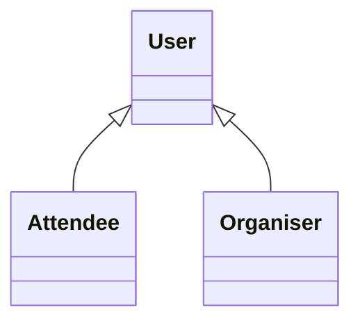

# Workshop 2

```{admonition} By Now You Should Have
:class: important
- Formed a team of 5 (all in this workshop) and submitted the Team Registration survey on Canvas.
- Accepted your GitHub invitation to the `SWEN90007-2026` organisation (sent in Week 2).
- Begun setting up your development environment (see the setup guides for the steps).
- Started thinking about your **domain model** for Part 1A.
- Been taking minutes of your weekly group meetings and recording them in your GitHub Wiki.
```

The purpose of today's workshop is to make real progress on **Part 1A** — your domain model. We'll cover what a good domain model looks like, work through a complete example together, and learn the diagramming tools so you can produce yours.

## Part 1A at a glance

Part 1A asks you to design your application's **domain model** and present it as a **domain model diagram plus an accompanying written description**.

::::{grid} 1 1 3 3
:gutter: 3

:::{grid-item-card}
:class-card: sd-shadow-sm sd-rounded-3 sd-border-0
:class-header: sd-bg-primary sd-text-white sd-font-weight-bold sd-text-center sd-fs-6
:class-body: sd-text-center

📦 Deliverable
^^^
A domain model diagram and its written description, in your GitHub **Wiki**.

_No LMS submission._
:::

:::{grid-item-card}
:class-card: sd-shadow-sm sd-rounded-3 sd-border-0
:class-header: sd-bg-primary sd-text-white sd-font-weight-bold sd-text-center sd-fs-6
:class-body: sd-text-center

🏷️ Submission
^^^
A release tag in the required format, pushed **before** the deadline.
:::

:::{grid-item-card}
:class-card: sd-shadow-sm sd-rounded-3 sd-border-0
:class-header: sd-bg-primary sd-text-white sd-font-weight-bold sd-text-center sd-fs-6
:class-body: sd-text-center

🎯 8 marks
^^^
Modelling of the problem · correct UML notation · the right level of abstraction · an accurate description.
:::
::::

Part 1A is assessed **entirely from your GitHub Wiki and release tag** — there is no oral assessment or video for it. If it isn't in the Wiki under the tag before the deadline, it isn't marked.

## Expected Knowledge

Software Modelling and Design is a prerequisite for this subject, so you are expected to be comfortable with:

- object-oriented programming, and
- creating use cases and domain models.

If you'd like a refresher, we recommend:

- the course notes (available on LMS),
- *Applying UML and Patterns* by Craig Larman, and
- *Writing Effective Use Cases* by Alistair Cockburn.

## What is a domain model?

A **domain model** is a visual representation of the *concepts* in your problem domain and the relationships between them — the vocabulary of the system, drawn from the requirements, **before** you worry about code, screens, or database tables.

Keep it **conceptual**: at this stage your model captures *what the system is about*, not how it is built. Include conceptual classes (things the domain talks about), their **attributes**, and their **associations**; show **multiplicities** and, where relevant, **generalisation** (is-a hierarchies). Leave out methods, controllers, servlets, JSON, primary/foreign keys, and UI details — those come in later parts.

This matters for your mark: one of the four things Part 1A is assessed on is *"appropriate level of detail and abstraction."* A model cluttered with implementation detail loses marks just as one that is too sparse does.

### The four steps we'll use

::::{grid} 1 1 2 2
:gutter: 3

:::{grid-item-card}
:class-card: sd-shadow-sm sd-rounded-3 sd-border-0
:class-header: sd-bg-secondary sd-text-white sd-font-weight-bold

1. Find the concepts
^^^
Read the use cases and underline the **nouns** — your candidate classes (people, things, transactions, roles).
:::

:::{grid-item-card}
:class-card: sd-shadow-sm sd-rounded-3 sd-border-0
:class-header: sd-bg-secondary sd-text-white sd-font-weight-bold

2. Add attributes
^^^
Capture the data each concept holds — the properties the requirements mention (a title, a date, a status).
:::

:::{grid-item-card}
:class-card: sd-shadow-sm sd-rounded-3 sd-border-0
:class-header: sd-bg-secondary sd-text-white sd-font-weight-bold

3. Draw associations
^^^
Connect related concepts, label each with a verb, and add **multiplicities** at both ends.
:::

:::{grid-item-card}
:class-card: sd-shadow-sm sd-rounded-3 sd-border-0
:class-header: sd-bg-secondary sd-text-white sd-font-weight-bold

4. Generalise & note states
^^^
Pull shared concepts into **is-a** hierarchies, and note any **lifecycle states** an entity moves through.
:::
::::

## A worked example: a library lending system

To learn the technique without simply copying the answer, we'll model a **different** domain from your project: a small **library lending system**. It has the same *shapes* of problem you'll meet in your project — users with different roles, a bookable resource that changes state, a borrowing lifecycle, and money owed — so the modelling skills transfer directly.

```{admonition} Example requirements
:class: note
- The library has **members** (who borrow) and **librarians** (staff who issue loans and manage stock). Both are people with a name and email; librarians additionally have a staff number.
- The library holds **books** (a title, by an author, identified by an ISBN). Each book has one or more physical **copies**, and each copy is either *available*, *on loan*, or *reserved*.
- A member can **borrow** an available copy, creating a **loan** with a borrow date and a due date. When the copy is returned, the loan is closed.
- A member can **reserve** a book that is currently unavailable.
- If a loan is returned late, it incurs a **fine** (an amount the member owes). Members can view and pay down what they owe.
```

**Step 1 — find the concepts.** Underlining the nouns gives us: *Person* (member/librarian), *Book*, *Copy*, *Loan*, *Reservation*, *Fine*.

**Step 2–4 — attributes, associations, generalisation, and states.** Working through the requirements produces the model below.

```{figure} resources/library_domain_model.svg
:alt: Class diagram of the library domain model
:width: 460px
:align: center

The library domain model. Copy the source into a `*.puml` file (see **Diagramming tools**, below) to reproduce and edit it.
```

::::{admonition} PlantUML source — `library.puml`
:class: dropdown

```
@startuml
' --- Generalisation: a member and a librarian are both people ---
Person <|-- Member
Person <|-- Librarian

' --- Associations with multiplicities and a reading direction ---
Book     "1"   -- "1..*" Copy        : has >
Member   "1"   -- "*"    Loan        : borrows >
Copy     "1"   -- "*"    Loan        : lent as >
Librarian "1"  -- "*"    Loan        : issues >
Member   "1"   -- "*"    Reservation : places >
Book     "1"   -- "*"    Reservation : for >
Loan     "1"   -- "0..1" Fine        : may incur >

class Person {
  name
  email
}

class Member {
}

class Librarian {
  staffNumber
}

class Book {
  title
  author
  isbn
}

class Copy {
  barcode
  status
}

class Loan {
  borrowedAt
  dueAt
  returnedAt
  status
}

class Reservation {
  placedAt
  status
}

class Fine {
  amount
  paidAt
}

@enduml
```
::::

**Why the model looks like this — the decisions worth explaining in your description:**

- **`Book` vs `Copy`.** A *book* is the abstract title; a *copy* is a physical item you can actually lend. Modelling them separately lets many copies exist for one title, and lets a single copy be *available* / *on loan* / *reserved* — the `status` lives on `Copy`, not `Book`. Collapsing them would make "borrow a copy" impossible to express cleanly.
- **`Loan` and `Reservation` as their own classes.** A borrowing isn't an attribute of a member or a copy — it's a *thing* with its own data (dates, status) that links the two. These are **association classes / transactions**, and they carry the lifecycle.
- **Multiplicities encode the rules.** `Book "1" -- "1..*" Copy` says every book has *at least one* copy; `Loan "1" -- "0..1" Fine` says a loan has *at most one* fine. Getting these right is where a lot of the modelling marks are.
- **Generalisation.** `Member` and `Librarian` share `name`/`email`, so they generalise to `Person`. This is a deliberate choice you should be able to justify.
- **States are domain rules.** A `Copy` moves *available → on loan → available*, and *available → reserved*; a `Loan` moves *active → returned* or *active → overdue*. You capture the *attribute* (`status`) in the domain model and describe the valid transitions in your accompanying text.

### Map the shapes onto your own project

Notice the transferable patterns — every one has an analogue in your ticketing platform:

| Modelling shape (library) | The same shape appears in your project as… |
| --- | --- |
| `Person → Member / Librarian` (generalisation) | users who have different roles |
| `Copy` with a `status` (a resource that changes state) | the thing an attendee actually books |
| `Loan` (a transaction with a lifecycle) | the record created when someone books |
| `Fine` (money in the domain) | how you represent balances and charges |

Identifying and modelling these for your domain is exactly the Part 1A task — so build your own model from your requirements; **don't copy the library one.**

## Applying it to your project

Take the project spec's **Functionality** section and run the same four steps over *your* use cases. As you do, ask yourself:

- **Concepts:** which nouns in the requirements are real domain concepts, and which are just UI or wording?
- **Attributes:** what data does each concept genuinely own? (e.g. what belongs on the event vs. on a section vs. on an individual seat?)
- **Associations & multiplicity:** how many of each relate to each other? Which relationships are `1..*` vs `0..*` vs `1`?
- **Transactions:** which of your concepts are *records of something happening* (with their own data and lifecycle) rather than static things?
- **Generalisation:** is there shared structure worth pulling into an is-a hierarchy? Can you justify it?
- **States:** which entities move through a lifecycle, and what are the valid transitions?

## Diagramming tools

Every diagram in this subject is **UML**, and the modern way to make one is **diagram-as-code**: you describe the diagram in a few lines of text and a tool renders it. Text beats drag-and-drop editors here — it versions cleanly in git, is reviewable in a pull request, and never leaves you chasing a stale exported image. You'll use the same approach for every diagram across the project (class, sequence, activity, component, state, …).

Here are three ways to create one, from zero-setup to full IDE integration.

### 1. Author it straight in your GitHub Wiki (recommended)

GitHub renders **Mermaid** automatically wherever you write Markdown — issues, `README`s, and your **project Wiki**. Just drop your diagram into a fenced code block tagged `mermaid`:

````text

````

Save the page and GitHub shows the rendered diagram in place — no installs, no image files, and it lives exactly where your Part 1A work is assessed. Change the text, save, and it re-renders. See the [Mermaid class-diagram syntax](https://mermaid.js.org/syntax/classDiagram.html) for attributes, multiplicities, and generalisation (`<|--`).

::::{admonition} The full library model in Mermaid — paste this into a `mermaid` block in your Wiki
:class: dropdown

```
classDiagram
    Person <|-- Member
    Person <|-- Librarian
    Book "1" --> "1..*" Copy : has
    Member "1" --> "*" Loan : borrows
    Copy "1" --> "*" Loan : lent as
    Librarian "1" --> "*" Loan : issues
    Member "1" --> "*" Reservation : places
    Book "1" --> "*" Reservation : for
    Loan "1" --> "0..1" Fine : may incur

    class Person {
      name
      email
    }
    class Librarian {
      staffNumber
    }
    class Book {
      title
      author
      isbn
    }
    class Copy {
      barcode
      status
    }
    class Loan {
      borrowedAt
      dueAt
      returnedAt
      status
    }
    class Reservation {
      placedAt
      status
    }
    class Fine {
      amount
      paidAt
    }
```
::::

### 2. Preview in the browser as you iterate

Want a live preview outside GitHub while you draft? Paste your source into a web editor, watch it update as you type, and export an SVG/PNG if you need a static image:

- **Mermaid** → [mermaid.live](https://mermaid.live)
- **PlantUML** → [the PlantUML web server](https://www.plantuml.com/plantuml/uml/)

### 3. Work in your IDE (PlantUML + IntelliJ)

If you'd rather keep diagrams beside your code, **PlantUML** renders live inside IntelliJ — this is what the library diagram earlier in this workshop was built with.

1. Install [Graphviz](https://graphviz.org) — PlantUML uses it to lay out diagrams.
2. Install the [PlantUML integration plugin](https://plugins.jetbrains.com/plugin/7017-plantuml-integration).
3. Create a new `*.puml` file and paste in a diagram — IntelliJ renders it live beside the source.


The full library model in PlantUML is in the **PlantUML source** dropdown earlier in this workshop; see [PlantUML's class-diagram guide](https://plantuml.com/class-diagram) for the syntax.

## Submitting Part 1A

Part 1A is **Wiki-only** — there is no submission to Canvas/LMS. Everything is assessed from your GitHub Wiki under a release tag. Before the deadline, work through this checklist:

- [ ] Your domain model **diagram** is in the Wiki, using correct UML class-diagram notation.
- [ ] Classes carry the **attributes** they need — no implementation detail (no keys, methods, or UI).
- [ ] Every association has a **multiplicity** at each end and a verb labelling it.
- [ ] Any **generalisation** hierarchies your domain calls for are shown.
- [ ] A **written description** walks a reader through the model and _justifies your key modelling choices_ (this is half of what's assessed).
- [ ] Your **team details** (names, student IDs, usernames) are recorded as required.
- [ ] A **release tag** named `SWEN90007_2026_Part1A_<team name>` is pushed before the deadline. ([How to create a tag.](https://docs.github.com/en/desktop/contributing-and-collaborating-using-github-desktop/managing-commits/managing-tags))

The teaching team can see when you create a tag and will check it was pushed before the deadline — late tags attract the standard 10%-per-day penalty.
