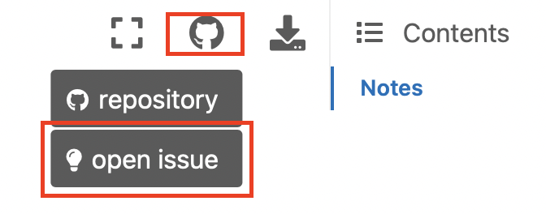

# Introduction

The purpose of these course notes is to act as a resource for students to consult throughout the semester while 
undertaking:

- [SWEN90007 Software Design and Architecture](https://handbook.unimelb.edu.au/2022/subjects/swen90007)

```{attention}
This handbook will act as a living guide, so please feel free to raise an issue in the top right-hand side of this 
website, if you want to raise suggestions or advice.


```

## Contributors

A big thank you to the contributors who worked on these course notes. You can get in contact with them 
[here](https://github.com/cis-projects/swen90007_course_notes).

This work was supported by the University of Melbourne Chancellery Academic – Dual Delivery Contributions grant.

