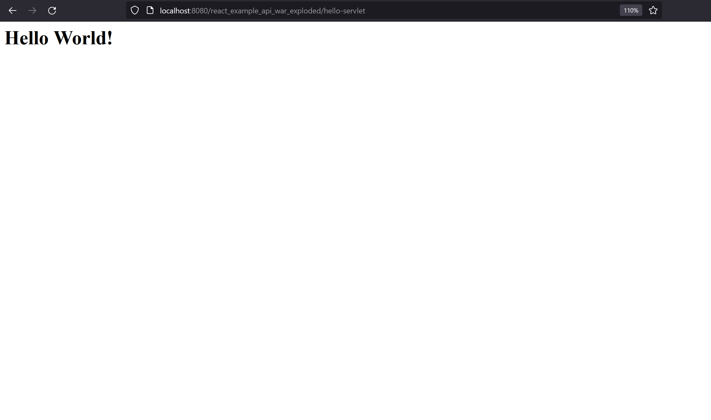
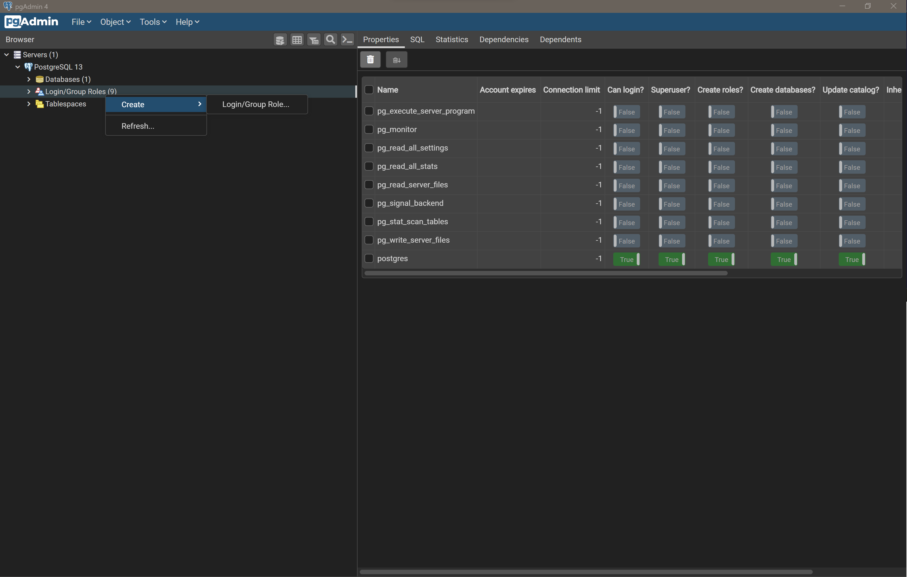
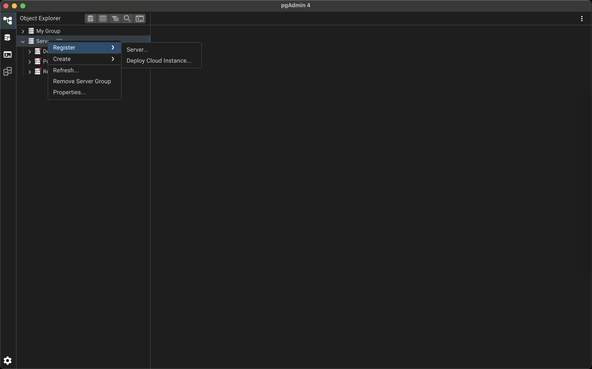

# Milestone 0: Hello World

By the end of this milestone we will have:

- a well structured repository that will house the source code for our UI and API systems
- a React project in which we can start implementing the UI
- a Java Servlet project in which to implement the API
- a database with a simple schema
- all these systems running locally and integrated

:::{admonition} Skipping milestones
:class: caution
This milestone builds upon the implementation contributed by previous milestones, if you've skipped those previous milestones, ensure that:

- your development environment is set up appropriately, as demonstrated in *Milestone -1: Tools*
:::

## Repository

To keep things incredibly simple we are going to develop both applications within the same repository.

Let's first create a new directory to house our project and initialise this as a Git repository:

```shell
mkdir swen90007-example
cd swen90007-exampled
git init
echo "# SWEN90007 Example Project" >> README.md
git -ma ":tada: Initial commit"
```

## React project

React is a library that greatly simplifies building complex *Single Page Applications (SPA)* for the web. It's a hugely popular tool, and has become the de facto standard for building experiences delivered via the web.

:::{admonition} Batteries included
:class: note
You may have come across other web technologies such as Angular, Next and SvelteKit. Many of these alternate technologies are referred to as *frameworks* (or even *meta-frameworks*, but we won't go there), and you might be wondering why we refer to React as a *library* instead. Web frameworks like Angular are said to come with *batteries included*, which refers to the fact that these tools bring with them **everything** you might need to build an SPA; they include, by default, components that provide solutions to common problems such as routing pages, dispatching AJAX requests, global state management, and even authentication - these frameworks will also often require developers to adopt various conventions around how a project is structured. This is not true of React, which is said to be *unopinionated* with respect to what your specific SPA requirements might be, or how you prefer to develop. The core React library ships with only the most essential functionality (such as dynamically rendering HTML and CSS), and expects developers - who may require further support (such as for page routing) - to explicitly import additional functionality from an external module.
:::

Initialising a React project is non-trivial; thankfully, [Create React App](https://create-react-app.dev/) is a handy tool developed to automate this task. The following command creates the directory `ui` and initialises it as a Node package and most importantly a React application.

```shell
npx create-react-app ui
```

This command may take sometime to execute - it downloads quite a lot of modules. However, once it's complete you'll have a fully functioning React app that you can start locally as so:

```shell
cd ui
npm run start
```

The above command should automatically launch the React application in your default browser, but if it doesn't, open a browser and go to [http://localhost:3000](http://localhost:3000) to view your newly minted React application.


### Linting for JavaScript

Because JavaScript is a dynamically typed language, it's strongly recommended that you spend the time to setup linting with [ESLint](https://eslint.org/). ESLint uses static code analysis to find and - in some cases - fix common errors, it will save you a great deal of time that might otherwise be wasted debugging simple issues (so much time, in fact, that no developer should embark on a JavaScript project without it!). We'll use NPM to manage ESLint, install it with the command below:

```shell
npm install --save-dev eslint
```

The easiest way to set up ESLint is with its handy initializer, run the following to interactively configure your project:

```shell
npx eslint --init
```

This project's ESLint was configured with the following options set:


You should now be able to run ESLint as so:

```shell
npx eslint .
```

ESLint will likely find some errors in the default React project created by `create-react-app`. You should spend a little time fixing what you can, but before you do that be aware that ESLint can - in some cases - automatically fix problems, pass the `--fix` flag to have the tool fix simple problems.

```shell
npx eslint . --fix
```

Finally, we can also register a script within the `package.json` file that will simplify the execution of linting, add the following to the `scripts` section of the configuration:

```json
"scripts": {
    "lint": "eslint .",
    "lint:fix": "eslint . --fix"
}
```

Now we can check for errors or coding style with `npm`.

```shell
npm run lint
```

And automatically fix some of those errors too.

```shell
npm run lint:fix
```

:::{admonition} NPM scripts
:class: tip
It's very common to register scripts with NPM in this way - in fact the `create-react-app` tool registers a number of custom scripts of its own - such as `start` (which we've used before) and `build`. The main reason for this is that it helps new developers understand what specific actions are appropriate for a particular project - if you're ever wondering how to start or build a particular project managed by NPM, checkout the `package.json` file, it will likely have a script configured.
:::

#### Visual Studio Code

If you plan to use VS Code to develop with React be sure to install the [ESLint extension](https://marketplace.visualstudio.com/items?itemName=dbaeumer.vscode-eslint), which will help identify problems as you develop. In the Extensions section search for *eslint* and select *install*  


## JavaEE Webapp project

Let's now begin setting up a project for our API. Assuming you are still in the UI directory, make a new directory - in the root of the repository - to house the API source code.

```shell
cd ../
mkdir api
```

Next, we'll initialise a new JavaEE project with IntelliJ IDEA. Create a new project configured as so (take care to ensure that the project is created as a *Jakata EE* project, in the correct directory - for example `./swen90007-react-example/api` - and that you target the correct versions of both the JDK and Tomcat - 17 and 10.0.27 respectively).  


Once correctly configured, select *Next*. On the next screen ensure that the Java *Servlet* dependency is included - you don't need anything else, so select *Create*. IntelliJ IDEA should create a JavaEE Webapp project with a few default implementations: a JavaServer Pages (JSP) file `webapp/WEB-INF/index.jsp` for rendering HTML, and a simple Servlet implementation `com.unimelb.swen90007.api.swen90007api.HelloServlet`.


Let's start the API to verify our project setup. Starting the API is dead easy, just select *Run* (the green *play* icon) in the top right of the IntelliJ IDEA UI (making sure that the *Tomcat 10.0.27* run configuration is selected from the dropdown menu next to the *Run* button). The application should start and launch a browser that serves HTML rendered by the default `webapp/WEB-INF/index.jsp` JSP file.


Selecting *Hello Servlet* should navigate the browser to the default `/hello-servlet` endpoint, returning the HTML generated by that Servlet.



## PostgreSQL

The final component to setup is the PostgreSQL database. We'll observe a number of PostgreSQL *best practices*, which encourage setting up dedicated databases, schemas and users for projects; this is entirely necessary, however, it does greatly improve the security posture of a system and avoids namespace conflicts that may occur when using the PostgreSQL server as a datastore for multiple systems.

In pgAdmin connect to your local PostgreSQL server and create a new user by right clicking on *Login/Group Roles* and selecting *Create* > *Login/Group Role...*.



We'll call this user `swen90007_react_example_owner`.


Ensure it has a strong password that is difficult to guess.


Grant it *Login* privileges so that it can connect to the database.


Select *Save* and notice that the `swen90007_react_example_owner` is created under *Login/Group Roles*.


Next, we'll create a dedicated database for this project, right click on *Databases* and select *Create* > *Database...*.


Name the new database `swen90007_react_example` and set the owner to the `swen90007_react_example_owner` user that we just created.


Select *Save* and notice that the new database is available under *Databases*.


Let's take a moment to verify that our new user and database work as required. Right click on *Servers* and select *Create* > *Server...*.



Name this server something you'll remember.


Provide connection details that target the new `swen90007_react_example` database and use the `swen90007_react_example_owner` credentials to login.


Select *Save* - you should now be authenticated as the `swen90007_react_example_owner`. Let's verify that the `swen90007_react_example_owner` has limited permissions. Right click on the `postgres` database managed by the new Server connection we've just created, and select *Query Tool*.


Let's try to create a new table in the `public` schema of the `postgres` database. Paste the following SQL into the Query Tool.

```sql
CREATE TABLE public.test (
 test_value varchar(255)
);
```

Select *Execute/Refresh* from the Query Tool's toolbar (the *play* icon) to execute the SQL against the `postgres` database. Notice that the execution fails and pgAdmin reports the error *permission denied for schema public* - as expected, the `swen90007_react_example_owner` has limited permissions, and is not authorised to manage the `postgres` database.


Let's try the same query against the `swen90007_react_example` database. Close the current Query Tool window and open another against the `swen90007_react_example` database, paste in the same SQL from previous and execute. The execution should be successful, and if you drill down to the tables within the `swen90007_react_example` database's `public` schema should see the new `test` table available.  


Finally, there is one last PostgreSQL *best practice* that we should observe: creating a dedicated schema for our application data. By default every PostgreSQL database has a schema called `public`, and it's very tempting to just throw all of our data in there. However, for complex systems this can lead to naming conflicts, especially if the system makes use of 3rd party dependencies that require access to create and persist data to tables (if two dependencies expect to manage tables with the same name, then we potentially have an issue).

:::{admonition} Liquibase
:class: note
[Liquibase](https://docs.liquibase.com/home.html) is a popular database-independent, schema migration tool that tracks and applies changes to a database in automated way. It assumes access to (and ownership of) two key tables in your database - `DATABASECHANGELOGLOCK` and `DATABASECHANGELOG` (creating them if required), which it uses to track what changes have been applied. This presents a special problem for projects that maintain a database schema that *already* references tables with that same name (perhaps because the domain models it's own version of a database change-log). Schemas are the perfect solution to this issue; we can simply configure Liquibase to create its tables within a `liquibase` namespace and store our application data in a separate `app` namespace - giving us confidence that we can avoid any schema conflicts.
:::

We'll create a schema called `app`, to which we'll persist data for this project. But first, we'll spend the time to clean up the public schema by dropping the `test` table we created earlier. In pgAdmin, expand the `public` schema, right click on the `test` table, and select *Delete/Drop*.


Creating the database schema is something that we'll likely need to do a fair few times - for instance each member of your team will need a local installation of PostgreSQL and valid schema to develop against, and when you later deploy to the cloud you'll need to initialise that PostgreSQL database instance with an appropriate schema. For this reason we'll declare our schema in a file we can version control and share.

Create the file `api/db/init.sql`, with the contents:

```sql
BEGIN;
CREATE SCHEMA IF NOT EXISTS app AUTHORIZATION swen90007_react_example_owner;
COMMIT;
```

We can use pgAdmin to run this script against the `swen90007_react_example` database. Right click on `swen90008_react_example` and open the Query Tool, then select *Open File* (look for the *file* icon) from the Query Tool toolbar, navigate to the `api/db/init.sql` file.


Select *Select* to load the file into the Query Tool and then select *Execute/Refresh*. There should now be a new `app` schema listed along with the default `public` schema for the `swen90007_react_example` database.


## Local integration

Congratulations, you should now be able to run, locally, all of: a React SPA, a Java built API and a database. However, none of these components are able to communicate; we'll fix that now by integrating each component, and verifying that data can flow through our entire system from UI to database - and back again.

### Data layer

We'll start our integration effort from the bottom up, beginning with setting up a simple Data Layer that can serve dummy data to our API. To do this, we'll need to both: build out our schema by populating it with a few tables; and load some dummy data. It can be helpful to separate these two tasks, so we'll write two simple SQL scripts for each. We've already written the initialisation script `api/db/init.sql`; which, so far, only initialises the `app` schema. Let's extend that script to create a simple table - which will be just enough, for now, to verify integration between our Data Layer and the layers above.

```sql
BEGIN;

-- schema creation from previous step

CREATE TABLE IF NOT EXISTS app.test (
 test_value varchar(255)
);
COMMIT;
```

Let's also populate that table with some dummy data. Create the file `api/db/load.sql` with the following SQL contents:

```sql
BEGIN;
INSERT INTO app.test (test_value) VALUES ('dummy data from the database!!!');
COMMIT;
```

Load and run both of those scripts, in order, using the Query Tool (as demonstrated earlier), and verify that the schema and data has been properly initialised by confirming that the following query returns the correct rows:

```sql
SELECT * FROM app.test;
```


Notice that the Query Tool *Data Output* tab shows the required response.

### Business (+ Persistence) layer

The Business Layer will be implemented in the JavaEE Webapp project. It sits between the Data and Presentation Layers; and, as its name suggests, is responsible for executing business logic (such as, in this instance, the verdict is derived from the votes placed *for* and *against* a topic), and enforcing business rules (a vote must be either *for* or *against* a topic, and *rejected* votes are removed from the verdict). Naturally, the Business Layer requires access to system data served from the Data Layer. Additionally, the Business Layer is responsible for accepting and servicing requests generated by the Presentation Layer. When verifying our Business Layer, we'll need to confirm two things:

- the Business Layer can consume data stored in the database
- the Business Layer accepts and responds to requests with the appropriate data

:::{admonition} Business and Persistence layers
:class: note
Our Java API will end up becoming fairly complicated, and so it will become necessary decompose it into two cohesive layers - a business layer and a persistence layer. All of our important (an complicated) business logic will be implemented within a business layer, and in order to keep this layer as simple as possible we'll refactor the complexity of communicating with the database (including marshalling database row data into convenient Java objects - and back again) into a persistence layer. You may notice that at this stage of the project we've not made a clear distinction between these two layers (our business logic and persistence code are mixed), however as the project grows you'll notice these two distinct layers form.
:::

To keep things simple we can verify both of these within the same Servlet component. But first let's conduct a little house keeping within the JavaEE Webapp project we created previously. We won't be making use of JSPs for this project, so we can go ahead and delete the JSP file (generated, by default, when creating the JavaEE Webapp project) `src/main/webapp/index.jsp`; additionally, delete the generated `com.unimelb.swen90007.reactexampleapi.HelloServlet` `HttpServlet` implementation - we'll implement our own shortly.

To pull data into our Business Layer we'll make use of the Java Database Connectivity (JDBC) API, which exists to simplify the process of integrating Java applications with relational databases (and is, in fact, a great example of the Adapter Pattern - which you will have come across before). JDBC needs access to a *Database Driver* in order to connect to our PostgreSQL database. Such drivers are typically implemented on a per-RDBMS-basis so you'll need to ensure that you include a driver that targets PostgreSQL. Include the following dependency coordinates in your project `pom.xml` to configure Maven to fetch a compatible PostgreSQL driver.

```xml
<dependency>  
  <groupId>org.postgresql</groupId>  
  <artifactId>postgresql</artifactId>  
  <version>42.5.3</version> 
</dependency>
```

Now that we have a driver configured, let's implement a simple Java Servlet `com.unimelb.swen90007.reactexampleapi.api.TestResource` that initialises the driver and - in response to a GET request - fetches and returns data from the database.

```java
package com.unimelb.swen90007.reactexampleapi.api;  
  
import jakarta.servlet.ServletException;  
import jakarta.servlet.annotation.WebServlet;  
import jakarta.servlet.http.HttpServlet;  
import jakarta.servlet.http.HttpServletRequest;  
import jakarta.servlet.http.HttpServletResponse;  
  
import java.io.IOException;  
import java.sql.*;  
  
@WebServlet(name = "test", urlPatterns = "/test")  
public class TestResource extends HttpServlet {  
    private static final String PROPERTY_JDBC_URI = "jdbc.uri";  
    private static final String PROPERTY_JDBC_USERNAME = "jdbc.username";  
    private static final String PROPERTY_JDBC_PASSWORD = "jdbc.password";  
    private static final String SQL_GET_TEST = "SELECT * FROM app.test;";  
  
    @Override  
    protected void doGet(HttpServletRequest req, HttpServletResponse resp) throws ServletException, IOException {  
        // open a connection and fetch the row from the 'test' table and return  
        try (Connection connection = DriverManager.getConnection(  
                System.getProperty(PROPERTY_JDBC_URI),  
                System.getProperty(PROPERTY_JDBC_USERNAME),  
                System.getProperty(PROPERTY_JDBC_PASSWORD)))  
        {  
            try (PreparedStatement statement =  connection.prepareStatement(SQL_GET_TEST)) {  
                ResultSet results = statement.executeQuery();  
                results.next();  
                resp.getWriter().println(results.getString("test_value"));  
            }  
  
        } catch (SQLException e) {  
            throw new RuntimeException(e);  
        }  
    }  
  
    @Override  
    public void init() throws ServletException {  
        // load the driver  
        try {  
            Class.forName("org.postgresql.Driver");  
        } catch (ClassNotFoundException e) {  
            throw new RuntimeException(e);  
        }  
        super.init();  
    }  
}
```

There are three things to be aware of with this Servlet:

- the Servlet loads the driver to the classpath on initialisation. This is not a good pattern - and as you will see later, we opt for a better solution in subsequent milestones.
- the Servlet creates a connection with the database on a per-request-basis. Again this not a great pattern, which we'll address later.
- the Servlet expects connection data, such as the JDBC URI and client credentials, to be passed as system properties. This is just one method through which we can *externalise environmental configuration*, and is necessary for both keeping secret data (such as passwords) out of our source code, and also for ensuring we can easily deploy the same source code to different environments - in which we may need to connect to a database via an environment specific URI.

The Servlet expects the system properties `jdbc.uri`, `jdbc.username`, `jdbc.password` to be available. We can get IntelliJ IDEA to manage these system properties for us. In the right section of the toolbar there should be a pre-configured run configuration called *Tomcat 10.0.27* (next to the run button); select this run configuration to reveal a drop-down, from the menu's few options select *Edit Configurations...* to open the *Run/Debug Configurations* modal. In the *VM options* input provide the following values (replacing `<a password>` with the password you configured when creating the `swen90007_react_example_owner` user):

```text
-Djdbc.uri=jdbc:postgresql://localhost:5432/swen90007_react_example
-Djdbc.username=swen90007_react_example_owner
-Djdbc.password=<a password>
```


To see the Servlet in action let's start the server in *Debug mode* (look for green *bug* icon next to the *Run* button) and place a breakpoint in the `com.unimelb.swen90007.reactexampleapi.api.TestResource#doGet` method. Then, in a browser, navigate to `http://localhost:8080/react_example_api_war_exploded/test`. Return to IntelliJ IDEA, which should now be waiting at the breakpoint.


Select *Resume Program* (lower left corner of the *Services* tab), and observe that the data retrieved from the database is returned to the browser.


### Presentation layer

The Presentation Layer is responsible for displaying application state to the user, and provides a convenient user-friendly interface through which the user can fulfil their user-goals. This layer will be entirely implemented with React, so let's spend a few moments on the very basics of React that you will need to know at this point.

#### React components

The primitive building block of all React systems is the *component*. Components allow us to decompose large complicated systems into a collection of simple, easy to understand, and ideally reusable, units of functionality - they enable us to observe software design principals such as *Don't repeat Yourself* (DRY) and *High Cohesion* when developing for the web.

##### A first component

A component is essentially just a function (or class! There are a few implementation styles - we'll use, exclusively, the functional style in this project) that returns JavaScript and XML (JSX). Components can be as simple as the the one below, which returns a `<p>` element to be rendered.

```jsx
import React from 'react';

function Simple() {
  return (
    <p>some static value</p>
  );
}

export default Simple;
```

The HTML rendered by this component would simply be:

```html
<p>some static value</p>
```

##### Composing components

We can compose components to build complex systems, piece by piece. For example, consider this component that makes use of the `Simple` component we defined earlier:

```jsx
import React from 'react';
import Simple from './Simple';

function SimpleParent() {
  return (
    <div>
      <Simple />
      <Simple />
    </div>
  );
}

export default SimpleParent;
```

The `SimpleParent` component renders the following HTML in the browser

```html
<div>
 <p>some static value</p>
 <p>some static value</p>
</div>
```

##### Dynamic components

The previous components were not particularly interesting, they simply render static data - which is fine for very simple applications, however, most applications worth building in React are dynamic. We can implement dynamic components in a number of ways, but the most basic approach is to make use of *component properties* (frequently shortened to *props*). Components can declare a set of properties, to which parent components can *bind* values. Consider a revised implementation of the `Simple` component that uses *props*:

```jsx
import React from 'react';
import PropTypes from 'prop-types';

function Simple({ aProperty }) {
  return (
    <p>
      some dynamic value:
      {' '}
      {aProperty}
    </p>
  );
} 

Simple.propTypes = {
  aProperty: PropTypes.string.isRequired,
};

export default Simple;
```

There's two important things happening here:

- the `Simple` component declares a *prop* called `aProperty`
- the `Simple` component returns JSX that *references* the `aProperty` prop. One of the key benefits of JSX is that it enables us to write JavaScript directly in our markup (and vice-versa) - in the above example React renders the resulting HTML by first interpolating the value of `aProperty` into the content of the `<p>` element.

:::{admonition} `prop-types`
:class: tip
[`prop-types`](https://www.npmjs.com/package/prop-types) is a library that implements runtime checking for component props. It's especially useful because quite a few IDEs will detect props definitions declared with `prop-types`, and conduct static analysis to provide code hints and flag possible errors. You should get into the habit of using this library - indeed ESLint, as configured in previous sections, will complain if you don't. You can install `prop-types` with NPM:

```shell
npm install --save prop-types
```

:::

Parent components can bind values to the properties declared by child components by passing them as HTML attributes.

```jsx
import React from 'react';
import Simple from './Simple';

function SimpleParent() {
  return (
    <div>
      <Simple aProperty="some value" />
      <Simple aProperty="some other value" />
    </div>
  );
}

export default SimpleParent;
```

The `SimpleParent` component now renders:

```html
<div>
 <p>some dynamic value: some value</p>
 <p>some dynamic value: some other value</p>
</div>
```

#### React containers and hooks

The components discussed above are *pure* components, which refers (in part) to the fact that they are stateless - they either, simply return JSX in a static way, or *deterministically* translate a number of received properties into JSX. We like *pure* components because they have no side effects, and are therefore easy to understand and reason about; however, at some point, any interesting application needs a way to introduce and manage state; for example, user generated state (from inputs) may need to be memoized before handling in some other way, or data received from another system may need to be captured before displaying to the user.

It's become convention to make a distinction between stateless and stateful components; you will likely find many different references to both *dumb* and *smart*, or even *skinny* and *fat*, components online and - perhaps - at work too. This primer adopts the language *component* and *container* to refer to stateless and stateful components respectively. These labels are not at all technical, and it's unlikely that you will see them used in any of the official React documentation, but they do point to a general understanding that React projects benefit from a small amount of design along the lines of application state. In general it's a good idea to ensure that presentation-oriented components (those that are concerned with *how the application looks*, and return *styled* markup) are simple stateless *components* that receive their state as props from *containers* (which are responsible for *how the application works* and return no markup, instead delegating presentation logic to child *components*).

##### useState hook

The most basic way to add state to a component is to declare a *useState hook*. This effectively introduces a stateful mechanism that behaves a lot like a local variable. Try replacing the contents of the `src/App.js` file with the code below:

```jsx
import React, { useState } from 'react';

function App() {
  const [count, setCount] = useState(0);

  return (
    <>
      <p>
        Current count is:
        {' '}
        {count}
      </p>
      <button
        type="button"
        onClick={() => setCount(count + 1)}
      >
        Increment count
      </button>
    </>
  );
}

export default App;
```

Restart your development server if you've since stopped it (`npm run start`), and notice that clicking the button increments the count. A number of things make this work:

- the `useState(0)` invocation creates the stateful hook and sets its initial value to `0`.
- the `useState(0)` invocation returns a list that we've unpacked (via JavaScript Destructuring) into two values - a reference to the current value `count`, and a function `setCount` that we use to update the stored value.
- notice that we can even write JavaScript arrow function expressions within JSX markup.

#### Fetching data from the API

We've finally covered just enough React, for now, to be able to fetch and display data from the API. With some minor modifications to the current `App` component we should be able to dispatch an AJAX call, store the response and render it as HTML.

We'll use the [Fetch API](https://developer.mozilla.org/en-US/docs/Web/API/Fetch_API) to fetch resources from the API. Refactor your `App` component to use `fetch`.

```jsx
import React, { useState } from 'react';

const API_BASE_URL = process.env.REACT_APP_API_BASE_URL;

function App() {
  const [data, setData] = useState(null);
  const [loading, setLoading] = useState(false);
  
  const fetchData = async () => {
    setLoading(true);
    setData(null);
    try {
      const res = await fetch(
        `${API_BASE_URL}/test`,
      );
      if (res.status > 299) {
        setData(`woops! bad response status ${res.status} from API`);
        return;
      }
      setData(await res.text());
    } catch (e) {
      setData(`woops! an error occurred: ${e}`);
    } finally {
      setLoading(false);
    }
  };

  return (
    <>
      {data && <p>{data}</p>}
      {loading && <p>loading...</p>}
      <button
        disabled={loading}
        type="button"
        onClick={fetchData}
      >
        Fetch data
      </button>
    </>
  );
}

export default App;
```

There's quite a lot happening in the `App` component now, let's tackle a couple of the key points:

- the request to the API is dispatched by clicking the button element, whose `onClick` attribute is bound to the `fetchData` function.
- the `fetchData` function makes an `async` call to the APIs `/test` route, which we implemented prior.
- as with our API implementation, we're externalising environmental configuration (such as the API's base URL) so that we can deploy our UI to any environment without having to change the source code. In this instance, we're making use of environment variables to pass environmental configuration - note that React will only interpolate environment variables prefixed with `REACT_APP_`, hence the naming `REACT_APP_API_BASE_URL`.  
- a component **must** return a **single** root JSX element, if we want to return a number of elements we must wrap them all in a parent element; we can avoid wrapping them all in redundant `<div>` tags (which would clutter the DOM) by using the empty `<>` tag.
- notice that we have some conditional JSX here; `{data && <p>{data}</p>}` renders the `<p>` tag only when data has been returned from the API.

Return to your browser and click *Fetch data*.


An error is reported, why? Inspect the network calls and notice that the request to the `/test` resource has been blocked because the *CORS header 'Access-Control-Allow-Origin' \[is\] missing*. CORS stands for Cross Origin Resource Sharing, and is a security feature built into all modern web browsers. What's happening here is that the browser is refusing to dispatch the request to the API because it believes the request to be unsafe.


:::{admonition} What is CORS?
:class: note
CORS is an important security measure that ensures malicious websites can't trick unsuspecting users into accessing legitimate resources - and, in the process, steal confidential user information. Specifically, CORS prevents a hacker from serving a weaponised version of your bank's online banking UI that can integrate with your bank's legitimate backend - not only would such a site be particularly convincing (it would, after all, have access to your actual banking data), but it could also quite easily intercept data exchanged between itself and the API (your credentials, balance, contact details, etc). CORS prevents this kind of threat by ensuring your browser enforces a set of *allowed* origins (websites) from which an API will accept requests; if the browser detects that the website it's accessing isn't trusted by an particular API then it will refuse to dispatch requests made by that website to access the API's resources. Relating this back to the online banking example, CORS prevents hackers from stealing your data by ensuring your browser refuses to send requests to your bank's API from any website that is not the bank's official (and trusted) banking UI.
:::

#### Fixing CORS issues

Our problems with CORS are due to the fact that our API is not responding correctly to *pre-flight requests* sent by the browser. The exact implementation required of the API is somewhat involved and includes responding to HTTP OPTIONS methods with a number of specific headers. We'll avoid the hassle of implementing our own CORS handling by configuring our JavaEE Webapp project with [Spring Security](https://spring.io/projects/spring-security).

Add the following dependency management configuration to your `pom.xml`, which references the Spring Security *Bill of Materials* (BOM) - a BOM pins the versions of a number of related dependencies so that you don't need to discover them for yourself (by, for example, referring to documentation and release notes).

```xml
<dependencyManagement>  
  <dependencies>
    <dependency>            
      <groupId>org.springframework.security</groupId>  
      <artifactId>spring-security-bom</artifactId>  
      <version>6.0.1</version>  
      <type>pom</type>  
      <scope>import</scope>  
    </dependency>
  </dependencies>
</dependencyManagement>
```

Then add the two Spring Security dependencies we require. Note that we don't need to include the version in these dependencies because the version is pinned by the BOM above.

```xml
<dependency>  
  <groupId>org.springframework.security</groupId>  
  <artifactId>spring-security-web</artifactId>  
</dependency>  
<dependency>  
  <groupId>org.springframework.security</groupId>  
  <artifactId>spring-security-config</artifactId>  
</dependency>
```

To configure Spring Security for CORS (CORS only, for now - we return to Spring Security later to configure authentication) we will need to implement two new classes `com.unimelb.swen90007.reactexampleapi.security.SecurityWebApplicationInitializer` that will register our CORS-enabled security configuration `com.unimelb.swen90007.reactexampleapi.security.WebSecurityConfig`

The initialiser is nothing terribly complicated.

```java
package com.unimelb.swen90007.reactexampleapi.security;  
  
import org.springframework.security.web.context.AbstractSecurityWebApplicationInitializer;

public class SecurityWebApplicationInitializer extends AbstractSecurityWebApplicationInitializer {  
    public SecurityWebApplicationInitializer() {  
        super(WebSecurityConfig.class);  
    }  
}
```

The configuration is somewhat more involved.

```java
package com.unimelb.swen90007.reactexampleapi.security;  
  
import org.springframework.context.annotation.Bean;  
import org.springframework.context.annotation.Configuration;  
import org.springframework.security.config.Customizer;  
import org.springframework.security.config.annotation.web.builders.HttpSecurity;  
import org.springframework.security.config.annotation.web.configuration.EnableWebSecurity;  
import org.springframework.security.web.SecurityFilterChain;  
import org.springframework.web.cors.CorsConfiguration;  
import org.springframework.web.cors.CorsConfigurationSource;  
import org.springframework.web.cors.UrlBasedCorsConfigurationSource;  
  
import java.util.Arrays;

@Configuration  
@EnableWebSecurity  
public class WebSecurityConfig {  
    private static final String PROPERTY_CORS_ORIGINS_UI = "cors.origins.ui";  
  
    @Bean  
    public SecurityFilterChain securityFilterChain(HttpSecurity http) throws Exception {  
        return http  
                .cors(Customizer.withDefaults())  
                .build();  
    }  
  
    @Bean  
    public CorsConfigurationSource corsConfigurationSource() {  
        CorsConfiguration configuration = new CorsConfiguration();  
        configuration.setAllowedOrigins(Arrays.asList(System.getProperty(PROPERTY_CORS_ORIGINS_UI)));  
        configuration.setAllowedMethods(Arrays.asList("GET"));  
        UrlBasedCorsConfigurationSource source = new UrlBasedCorsConfigurationSource();  
        source.registerCorsConfiguration("/**", configuration);  
        return source;  
    }  
}
```

A few things to observe:

- the `@Configuration`, `@EnableWebSecurity` and `@Bean` annotations are Spring annotations and beyond the scope of this primer.
- the `securityFilterChain` method registers our CORS configuration with the Spring `SecurityFilterChain`. Later, when we come to implement authentication, we'll revisit this method and configure additional security components, such as an authentication provider.
- the `corsConfigurationSource` method builds our CORS configuration.
- the CORS configuration permits GET requests from a single origin - this is, obviously, quite restrictive and we'll need to refactor this configuration when we add more functionality to our API. As in previous sections, we'll use Java system properties to provide environmental configuration - such as the allowed origins.
- and, finally, we register this configuration against all routes (`/**`) exposed by our JavaEE Webapp.

The API now expects an additional system property, `cors.origins.ui`, to be available. As in previous sections, we'll get IntelliJ IDEA to manage setting this system property. Add the following to the existing *VM options* for your *Tomcat 10.0.27* run configuration, and restart the API.

```text
-Dcors.origins.ui=http://localhost:3000
```

Return to your browser and click *Fetch data* once more, the request should now succeed and data from the database should be displayed in the browser.


Congratulations, you have a fully integrated system running locally! The next step will be to deploy this same system to the cloud.
