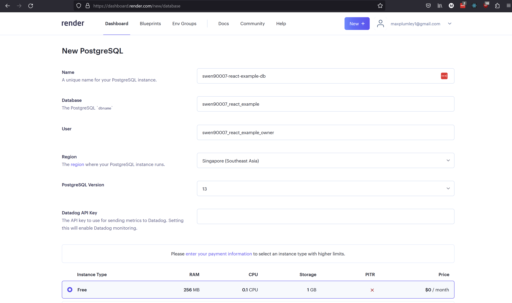
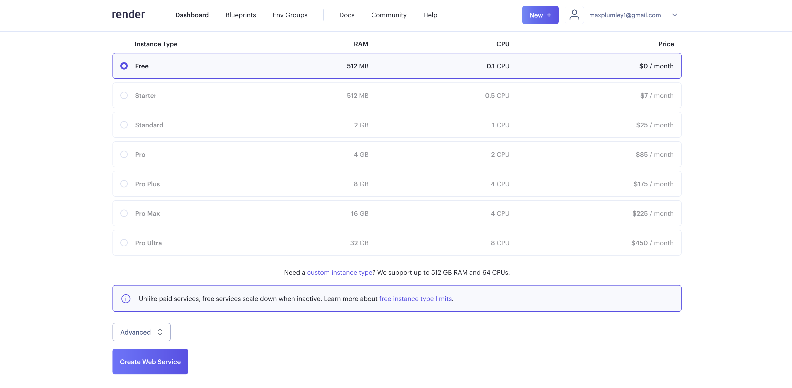
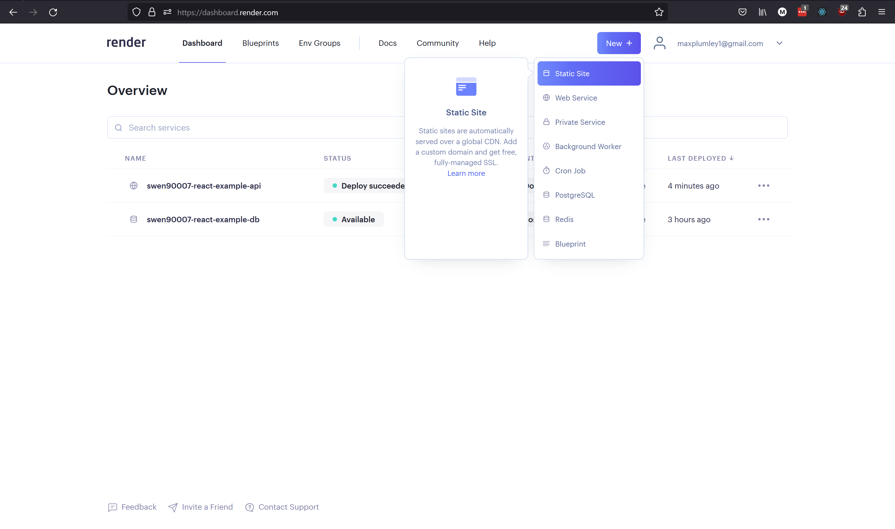

# Milestone 1: Deployment

By the end of this milestone we will have:

- the system (as implemented in *Milestone 1: Hello world*) containerised with Docker
- the system deployed to, and running on, Render's unified cloud

>[!warning] Skipping milestones
>This milestone builds upon the implementation contributed by previous milestones, if you've skipped those previous milestones, ensure that:
>
>- your development environment is set up appropriately, as demonstrated in *Milestone -1: Tools*
>- you have an appropriately set up PostgreSQL server running locally, with a database and user configured appropriately, as demonstrated in *Milestone 0: Hello world*
>- you've checked out the source code contributed by *Milestone 0: Hello world*

## Docker

Our first object for this milestone will be to *containerise* the components of our current system so that we can ship them to a cloud environment. We'll use the hugely popular Docker platform to declare a set of dependency and build instructions that Render can use to serve our components.

> [!info] What is Docker, really
> Docker is a *containerisation solution*, it provides a way for us to build a version of our software that we can run anywhere. Java developers will find this concept familiar - after all, Java is marketed as a solution in which teams "build \[their software\] once, \[and\] run \[it\] anywhere". Docker works in much the same way, it provides a virtual environment - called a *container* - in which an application can run. However, unlike the Java Virtual Machine (JVM), Docker is not limited to running Java applications, it can build and run a portable version of **any** software (more, or less - there are, of course, limitations to all solutions 😙); from simple one-off shell scripts to fully fledged servers with a persistent presence, Docker is able to easily build a portable solution that you can run anywhere, and even share with others. Sounds pretty good right? Modern DevOps thinks so - so much so that containerisation solutions such as Docker are **the** ubiquitous gold-standard for implementing DevOps automation solutions. If you've not encountered Docker before, then you'll undoubtably come across it soon enough - it's well worth investing your time in building a strong understanding of containerisation.

### Install

If you've not a version of Docker running locally, you'll need to install it; Docker Desktop is a handy UI that ships with the latest docker CLI and daemon, install it [here](https://www.docker.com/products/docker-desktop/). Once installed, you will need to launch Docker Desktop, which will in turn launch Docker services such as the Docker Daemon. Verify your installation by running:

```shell
docker run hello-world
```

This command should run a container called `hello-world:latest`, which prints - amongst other things - `Hello from Docker!` to the console.

### Declaring container configuration

We use Docker to both *run* and *build* containers (usually in the reverse order). When we *run* a container Docker searches for a pre-built Docker *image* - fetching it from a well known place like [DockerHub](https://hub.docker.com/) if it doesn't exist locally. A Docker image typically declares a program, along with all its dependencies, to be executed by the Docker Daemon within a container. Images are can be *built* by providing Docker a set of instructions which we normally author as a [*DockerFile*](https://docs.docker.com/engine/reference/builder/).

We'll need to provide a Dockerfile for each of the components we want to containerise - and to be able to verify that our Docker configuration locally we'll also containerise a PostgreSQL image (though we won't need to deploy this to Render, we'll use Render's managed database service instead).

Before we can begin create our containers and verifying them locally we need to ensure they can communicate, to do this we should run them on a Docker *network*. Create a simple bridged network called `swen90007-react-example`

```shell
docker network create -d bridge swen90007-react-example
```

The first component to get working with Docker is the PostgreSQL database. Run the following command to start a containerised version of PostgreSQL:

```shell
docker run --network=swen90007-react-example -e POSTGRES_DB=swen90007_react_example -e POSTGRES_USER=swen90007_react_example_owner -e POSTGRES_PASSWORD=password --name database -dti -p 5433:5432 postgres:13
```

We'll need to run our database initialisation scripts against this containerised PostgreSQL. Simply start pgAdmin, and create a new server configured to connect to the containerised PostgreSQL - noting that the above Docker run command maps the PostgreSQL port 5432 to 5433 (to avoid conflicts with the existing local PostgreSQL service that has likely already claimed the host's 5432 port).


Then load and execute both `api/db/init.sql` and `api/db/load.sql` using pgAdmin's Query Tool.

The following is a Dockerfile that will build the JavaEE Webapp API. We'll version control this Dockerfile with the source code for API, save it as `api/Dockerfile`.

```dockerfile
# build stage
FROM maven:3.9-amazoncorretto-17 AS build
WORKDIR /app

COPY . .

RUN mvn clean package -DwarName=react-example-api

# run stage
FROM tomcat:10.0.27-jre17

COPY --from=build /app/target/react-example-api.war $CATALINA_HOME/webapps/
```

The purpose of this primer is not to teach you how to write Dockerfiles, however there are few key aspects to highlight here:

- we are using a *multi-stage build* to first compile our JavaEE Webapp with Maven, and then declare the Tomcat environment from which the Webapp will be served.
- Instead of having to figure out how to install Tomcat into a base *scratch* Docker image, we'll make use of all the hard work smart people have put into preparing the `tomcat:10.0.27-jre17` base image - and save ourselves a bunch of grief in the process.

Open a command terminal in the `/api` directory and build an image from the Dockerfile above

```shell
docker build --rm -t swen90007-react-example-api .
```

Then run the image with the following command:

```shell
docker run --network=swen90007-react-example -dti -p 8080:8080 -e JAVA_OPTS='-Djdbc.uri=jdbc:postgresql://database:5432/swen90007_react_example -Djdbc.username=swen90007_react_example_owner -Djdbc.password=password -Dcors.origins.ui=http://localhost:3000' swen90007-react-example-api
```

Open a browser and navigate to <http://localhost:8080/react-example-api/test>, you should see a familiar response from the containerised JavaEE Webapp.


> [!Question] Why is the *test* endpoint served on the path `/react-example-api/test`?
> This is decided partly by the design of the template API - the verdict resource is exposed by a Java Servlet listening on `/test` - and partly by the way Tomcat (the web server used in this project) serves our application. Tomcat detects and unpacks `.war` files to be served in a web container. To enable Tomcat to serve multiple applications (or `.war` files) it exposes each application on what is called a *context path*, which is used to route traffic to the appropriate application. This context path is derived (according to a few simple rules, which we'll not get into here) from the name of the `.war` file, and should be prepended to the request path as so `<context-path>/<the-application-routes>`. For this project we package our API as a `.war` file called `react-example-api.war`, and so Tomcat exposes our application on the context path `/react-example-api`; and so, if we want to access the *verdict* endpoint we need to make a request to `/react-example-api/test`.

Congratulations, you've containerised the JavaEE Webapp! And, can now move onto deploying the system to Render.

## Deploy to Render

Renders is a Platform as a Service (PaaS) solution that enables developers to quickly deploy applications to the Render unified cloud. We'll be deploying all three of our services components to  Render, including a PostgreSQL database, the JavaEE Webapp containerised with Docker, and the simple React UI, implemented in prior milestones.

### Prerequisites

This guide assumes you have the source code for both the API and UI version controlled in a single private GitHub repository that you own.

You'll also need to sign up to [Render](https://render.com/), select *Get Started* from the top navigation bar and use whatever sign in option you prefer. Once signed in you should be redirected to the *Render Dashboard*, from which you can begin creating and managing the services required in this guide.

> [!Warning] Collaborating on Render
> Render's Free tier does not include *Render Teams*, which is a feature that allows you to nominate collaborators, who can log into your Render Dashboard and create or manage deployments. This means that your team will need to nominate a team member to be responsible for all Render tasks throughout semester (you might like to rotate this role) - this shouldn't, however, prevent other team members from deploying their own *development* or *test* versions of your team's application to their own Render accounts. Each team member should, at least, follow and understand the steps in this section of the primer, regardless of whether the team's application will be deployed to their account or not.  

## Postgres Managed Database

We'll deploy our system *bottom up*, starting with the PostgreSQL database.

From the Render Dashboard select *New +* > *PostgreSQL* to create a new managed PostgreSQL instance.  


Enter the following details for your new database

Name: `swen90007-react-example-db`
Database: `swen90007_react_example`
User: `swen90007_react_example_owner`
Region: Singapore (Southeast Asia) (much closer than the default Oregon region)
PostgreSQL Version: 13



Scroll down, leaving the default instance type configuration set to the Free tier, and select *Create Database*.


Render will begin provisioning a shiny new managed database for you - which can take a few minutes, so grab a snack :).

Once Render has finished provisioning the database the status will change to *Available*.


Let's pause a moment to verify that we can both, access the database, and that the database is working as expected. As in previous milestones, we'll do this via pgAdmin. Once you've launched pgAdmin you'll need to configure it to access the Render database. All the information that you need, the hostname of the database container, database name, user and password can be found in the *Connections* section of our Render database dashboard. Make a note of your database's connection data, you'll need it shortly.


In pgAdmin right click on *Servers* and select *Register* > *Server* to register the Render service as a managed server. You'll need to configure the new server by first providing it a name (this doesn't need to match the connection data in Render, it should just be something you will recognise in pgAdmin). Then provide the connection details pgAdmin should use to access the Render service.

- Hostname/address:  this should be the **external** hostname of the container to which the Render database has been provisioned, this is essentially the *External Database URL*, minus the protocol, user and database name information - ie just the hostname. Specifically, your *External Database URL* will look something like `postgres://<user-name>:<password>@<external-hostname>/<database-name>`, you want just the `<external-hostname>` section.
- Port: leave this as 5432.
- Maintenance database: the name of your Render database, see the *Connections* sections and look for the value of the *Database* attribute.
- Username: the name of the user you configured for the Render database, set - in this guild - to `swen90007_react_example_owner`.
- Password: generated by Render when provisioning the service, find it in the *Connections* section discussed previously.


Select *Save* and you should see a new entry appear under the Servers group in pgAdmin. On selecting *Save*, pgAdmin will attempt to connect to the Render service using the server configuration provided, if it can't connect it will shout quite loudly that something is wrong, if this is the case confirm that you've provided the correct configuration as detailed in Render - noting that some of the configuration is generated during provisioning (the hostname and password, and possibly database name) and **will** differ from the values present in this guide.


Finally let's confirm that we can manage the instance by initialising our database with the test schema and dummy data developed in pervious milestones. Right click on the database and select *Query Tool*. From the Query Tool toolbar select *Open File* to load the `api/db/init.sql` script, then select *Execute/Refresh* to run it. Repeat the process for `api/db/load.sql`. The database should now be properly initialised, you can verify this by running a final query:

```sql
SELECT * FROM app.test;
```


Nice work! You've just provisioned a managed PostgreSQL instance on the Render platform, and verified the instance with pgAdmin.

## Web Service

Next we'll deploy the JavaEE Webapp as a Render Web Service.

From the Render Dashboard select *New +* > *Web Service* to create a new web service that will expose our API.


You'll need to follow the prompts to connect your Render account to your git repository in the subject's GitHub organisation. Select *Connect GitHub*, you may be prompted to then login to GitHub, follow the prompts to install the Render integration to your *personal* GitHub account and authorise Render to access the repository that you have pushed the latest project code to (see the official [Render docs](https://render.com/docs/github), should you get lost).


Once these systems are properly integrated and authorised you can continue to create the web service by selecting *New +* > *Web Service* again, notice that your newly integrated repository will be appear, select *Connect* for the appropriate repository.


On the next page provide the following information:

- Name: `swen90007-react-example-api`
- Region: Singapore (Southeast Asia) is probably still the closest
- Branch: it's highly likely that the default value, main, is entirely appropriate; this should be the name of the branch in your repository that you plan to merge working features into - ie the branch on which you plan to keep a stable, working version of your software.
- Root Directory: for this project we're version controlling the source code for both the API and UI in the same repository, the API code is what we plan to deploy to this web service so we need to configure Render to deploy from the `/api` directory.
- Runtime: we're using Docker to simplify our deployments - greatly.


We're almost done, keep the Free tier selected, and then expand the environment variable configuration by selecting *Advanced*.



The web service will need access to the managed PostgreSQL database, which you created previously. The best way to provide this configuration is via environment variables. The *Advanced* section of the Web Service configuration has a section for entering environment variables, which Render will set when it starts the application. Configure Render to set a `JAVA_OPTS` environment variable with the value below, making sure you replace `<your-database-internal-hostname>`, `<your-database-name>`, `<your-database-username>` and `<your-database-password>` with appropriate values.

`JAVA_OPTS`: `-Djdbc.uri=jdbc:postgresql://<your-database-internal-hostname>/<your-database-name> -Djdbc.username=<your-database-username> -Djdbc.password=<your-database-password> -Dcors.origins.ui=http://localhost:3000`


Select *Create Web Service* and you'll be redirected to the *Web Service dashboard*, where you can monitor the application logs. After a short wait your web service should be live. Let's verify it works as it should by executing a simple GET request. Open your preferred web browser and navigate to the *test* endpoint at `https://<your-web-service-hostname>/react-example-api/test` - replacing `<your-web-service-hostname>` with (you may have guessed it) the external host name of your web service, find it within your web service settings in the top banner, noting that it's almost certain that your hostname is different to the one shown below.


## Static Site

Finally, we'll deploy the React UI as a static site.

From the Render Dashboard select *New +* > *Static Site* to create a new static site from which we will serve the UI for this project.



Just like the Web Service from the previous section, we'll deploy our UI directly from the project repository, select *Connect* to connect the appropriate project repository. On the next page provide the following values:

Name: `swen90007-react-example-ui`
Branch: as with the web service, this should be the name of the branch to which you intend to push stable versions of your software, for most projects this is a branch called *main*.
Root Directory: the UI code is located in the `/ui` directory so we'll need to configure Render to deploy from there.
Build Command: the UI is a React application that uses the Node Package Manager (NPM) for dependency management and as a build tool. Most React applications managed by NPM - this one included - can be built by invoking the NPM build script as so `npm run build`.
Publish Directory: the NPM build script compiles the React source code as a set of files (`.js`, `.html` and `.css` files, as well as various other assets, which can served as a static website) written to a `./build` directory.


Like the web service this static site will need to be built and served with a number of environment variables set. These environment variables configure the UI to properly access the API.

`REACT_APP_API_BASE_URL`: `https://<your-web-service-hostname>/react-example-api`


Leave the rest of the Advanced configuration as is and select *Create Static Site*. Once the UI has been built and deployed it should be available at `https://<your-static-sites-hostname>`. We're not quite done though, if you visit the UI and attempt fetch data from the API you'll encounter a familiar error.


If you inspect the network calls between the UI and API, you'll notice that the GET against the `/test` endpoint encounters an error. The reason for this failure is improper CORS configuration on the API.


The API is currently configured to only accept requests from `https://localhost:3000`, this configuration has been appropriate when developing locally but, of course, not for our deployment to Render. Now that we have a UI deployed - to an origin provided by Render - let's update our API's CORS configuration so that it will accept requests to submit new votes. The origins that the API will accept can be configured by setting the `cors.origins.ui` property. Open the dashboard for your web service and navigate to the *Environment* section, edit the value of the `JAVA_OPTS` environment variable to declare a `cors.origins.ui` value equal to the hostname of your UI, then select *Save Changes*.


Render will redeploy the API with the new environment configuration. Once your API has been redeployed revisit your UI and click *Fetch data*, the request should now succeed.


Congratulations, you've just deployed the full React example stack to Render! In the next milestone we'll spend some time implementing the core features of the application, and get stuck into some more advanced React.

> [!warning] Render build time limits
>By default, Render will build and deploy each change to your *main* branch (or whichever branch you nominated) on GitHub; this is convenient, however, the Free tier on Render has strict *build time* limits, which you may hit quickly if you are pushing to *main* often, you should disabled automatic build and deploy if you plan to work on, or merge to, *main* often
