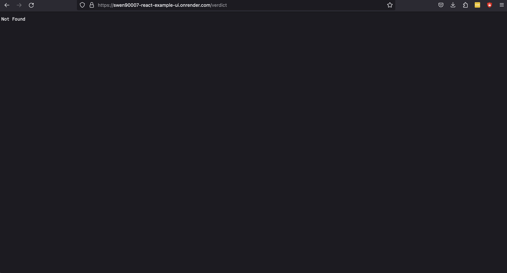
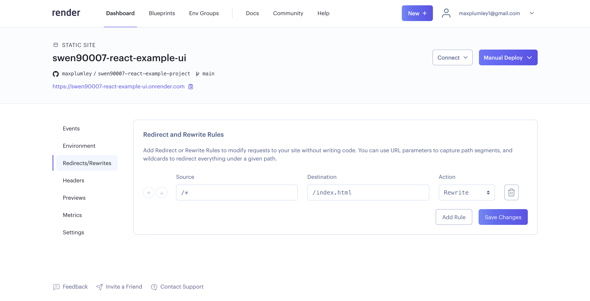

# Milestone 2: Deployment

By the end of this milestone we will have:

- core functionality for the system implemented
- the system deployed to, and running on, Render's unified cloud

:::{admonition} Skipping milestones
:class: caution
This milestone builds upon the implementation contributed by previous milestones, if you've skipped those previous milestones, ensure that:

- your development environment is set up appropriately, as demonstrated in *Milestone -1: Tools*
- you have an appropriately set up PostgreSQL server running locally, with a database and user configured appropriately, as demonstrated in *Milestone 0: Hello world*
- you've checked out the source code contributed by *Milestone 1: Deployment*
:::

## Database schema changes

The system we're building needs to be able to manage votes, however at the moment all the system does is serve dummy data. We'll need to make a few changes to our database so that it's able to store votes. But first, we'll spend a moment crafting a cleanup script, which comes in handy if we ever want to purge our database of test data. Add the following SQL to a  `drop.sql` file, and run it against your database to blow away our current dummy schema.

```sql
BEGIN;  
DROP SCHEMA app CASCADE;  
COMMIT;
```

Now that we're working with a clean database let's extend our current `init.db` script

```sql
BEGIN;  
CREATE SCHEMA IF NOT EXISTS app AUTHORIZATION swen90007_react_example_owner;  
  
CREATE TABLE app.vote (  
 id uuid NOT NULL UNIQUE,  
 name varchar(255),  
 email varchar(255) NOT NULL,  
 supporting bool NOT NULL,  
 status varchar(255) NOT NULL,  
 created timestamp with time zone NOT NULL,  
 PRIMARY KEY (id)  
);  
  
CREATE INDEX vote_is_supporting  
    ON app.vote (supporting, status);  
  
COMMIT;
```

We'll also populate a the database with a little dummy data to play with, make the following changes to `load.sql`:

```sql
BEGIN;  
INSERT INTO app.vote (id, name, email, supporting, status, created) VALUES  
    (gen_random_uuid(), 'Pepe Roni', 'pepe.roni@pie.com', true, 'UNVERIFIED', now()),  
    (gen_random_uuid(), 'Barbie Queue', 'b.queue@slice.com', true, 'UNVERIFIED', now());  
COMMIT;
```

## API changes

We'll need to extend the current API so that it can serve votes and the current verdict.

:::{admonition} Purpose of this example
:class: caution
Please be aware that the purpose of this example is to introduce you to working with React, *not* to provide an example implementation of the various patterns covered in this course.
:::

### Working with JSON

Our API will utilise JavaScript Object Notation (JSON) as a *data transfer format*, thus we'll need to marshal and unmarshal Java objects to and from JSON. JSON is relatively complicated - to build your own JSON parsing would be a fairly significant undertaking, and complete waste of time - so we'll make use of one of the more popular libraries [Jackson](https://github.com/FasterXML/jackson). Include the following coordinates in you Maven configuration (`pom.xml`).

```xml
<properties>  
    <jackson.version>2.14.2</jackson.version>   
</properties>

<dependencies>
    <dependency>  
        <groupId>com.fasterxml.jackson.core</groupId>  
        <artifactId>jackson-databind</artifactId>  
        <version>${jackson.version}</version>  
    </dependency>  
    <dependency>
        <groupId>com.fasterxml.jackson.datatype</groupId>
        <artifactId>jackson-datatype-jsr310</artifactId>
        <version>${jackson.version}</version>
    </dependency>
</dependencies>
```

### A simple domain

We'll implement a very simple domain, we'll create - amongst others - a `Vote` and `Verdict` class. See the `Vote` class below:

```java
package com.unimelb.swen90007.reactexampleapi.domain;  
import com.fasterxml.jackson.annotation.JsonIgnore;  
import java.time.OffsetDateTime;  
  
public class Vote {  
    private String id;  
    private String name;  
    private String email;  
    private boolean supporting;  
    private Status status;  
    private OffsetDateTime created; 
    private boolean _new = true;   
  
    // accessors, omitted for brevity ... 

    @JsonIgnore  
    public boolean isNew() {  
        return _new;  
    }  
    
    @JsonIgnore  
    public void setNew(boolean _new) {  
        this._new = _new;  
    }
  
    public static enum Status {  
        UNVERIFIED,  
        ACCEPTED,  
        REJECTED  
    }  
}
```

There's a few things to note in the above:

1. the `Status` enum is implemented as a static inner enum of the `Vote` class, as it'll never be referred to outside this vote context
2. the `_new` field will be used by our database mapping code to decide if a vote has just been created or updated.
3. the `_new` field will be purely internal, so we'll hide it from API consumers by annotating its accessors with the Jackson annotation `@JsonIgnore` - this will ensure that the Jackson library won't marshal this field as a JSON attribute.

We'll also implement a `VoteService` class that abstracts the complexity of working with the domain from the Servlet implementations - which we'd rather just focus on working with JSON and handling errors.

```java
package com.unimelb.swen90007.reactexampleapi.domain;  
  
import java.time.OffsetDateTime;  
import java.util.List;  
import java.util.Optional;  
import java.util.UUID;  
import java.util.regex.Pattern;  
  
public class VoteService {  
  
    private static final Pattern EMAIL_PATTERN = Pattern.compile("^[a-zA-Z0-9.!#$%&'*+/=?^_`{|}~-]+@[a-zA-Z0-9-]+(?:\\.[a-zA-Z0-9-]+)*$");  
  
    private final VoteRepository repository;  
  
    // constructors, omitted for brevity
  
    public Vote submit(NewVoteRequest request) {  
        if (request.getEmail() == null) {  
            throw new ValidationException(
                "email is required"
            );  
        } else if (!isEmailValid(request.getEmail())) { 
            throw new ValidationException(
                "email must be a valid email"
            );  
        }  
  
        var vote = new Vote();  
        vote.setId(UUID.randomUUID().toString());  
        vote.setName(request.getName());  
        vote.setEmail(request.getEmail());  
        vote.setSupporting(request.isSupporting());  
        vote.setStatus(Vote.Status.UNVERIFIED);  
        vote.setCreated(OffsetDateTime.now());  
        repository.save(vote);  
        return vote;  
    }  
  
    public Verdict calculateVerdict() {  
        var votes = repository.getValid();  
        var supporting = votes.stream()  
                .filter(Vote::isSupporting)  
                .count();  
  
        return new Verdict(  
                supporting,  
                votes.size() - supporting  
        );  
    }  
  
    public List<Vote> getAllVotes(long offset, long limit) {  
        // implementation, omitted for brevity
    }  
  
    public Vote updateVote(String id, UpdateVoteRequest request) {  
        // implementation, omitted for brevity  
    }  
  
    private boolean isEmailValid(String email) {  
        return EMAIL_PATTERN.matcher(email).find();  
    }  
}
```

Some of the service implementation above has been excluded for brevity, however what's included illustrates a few key principals:

1. the service exposes core functionality of the domain, via methods such as `submit` and `calculateVerdict`
2. the service is responsible for validating inputs, for example `isEmailValid`
3. the service is additionally responsible for enforcing key business rules, such as calculating the verdict
4. to keep the service lean we'll delegate the complexity of working with the database to a `VoteRepository`, on which the service will depend

:::{admonition} Java validation
:class: note
The validation carried out for this domain is rather limited, and so the naive approach of hardcoding this validation is acceptable. For complicated domains a more scalable, elegant solution is often required. One such solution is the [Jakarta Bean Validation](https://beanvalidation.org/) specification, which provides a suite of Java annotations that can be applied to classes, fields, methods and parameters to hint to validator implementations (such as the [Hibernate Validator](https://hibernate.org/validator/)) which constraints are to be applied. For example, consider the following class:

```java
class ToBeValidated {

 @NotNull
 private String value;
 
 // constructors and accessors, omitted for brevity ...
}
```

The following code will throw an error - the validator detects that the value of the `value` field is `null`:

```java
var invalid = new ToBeValidated();
var factory = Validation.buildDefaultValidatorFactory();
var validator = factory.getValidator();
validator.validate(invalid);
```

:::

### Data layer

Creating a database connection is expensive, and this expense adds up if our API is to be called often. To avoid the overhead involved in creating connections we'll implement a very simple connection pool.

```java
package com.unimelb.swen90007.reactexampleapi.port.postgres;  
  
import java.sql.Connection;  
import java.sql.DriverManager;  
import java.sql.SQLException;  
import java.time.Duration;  
import java.util.concurrent.BlockingDeque;  
import java.util.concurrent.LinkedBlockingDeque;  
import java.util.concurrent.TimeUnit;  
  
public class ConnectionProvider {  
  
    private static final int MAX_CONNECTIONS = 10;  
    private static final Duration ACQUIRE_CONNECTION_TIMEOUT = Duration.ofMillis(100);  
    private final String url;  
    private final String username;  
    private final String password;  
    private final BlockingDeque<Connection> connectionPool;  
  
    public ConnectionProvider(String url, String username, String password) {  
        this.url = url;  
        this.username = username;  
        this.password = password;  
        this.connectionPool = new LinkedBlockingDeque<>();  
    }  
  
    public void init() {  
        try {  
            Class.forName("org.postgresql.Driver");  
        } catch (ClassNotFoundException e) {  
            throw new RuntimeException(e);  
        }  
        while (connectionPool.size() < MAX_CONNECTIONS) {  
            connectionPool.offer(connect());  
        }  
    }  
  
    Connection nextConnection() {  
        try {  
            return connectionPool.poll(ACQUIRE_CONNECTION_TIMEOUT.toMillis(), TimeUnit.MILLISECONDS);  
        } catch (InterruptedException e) {  
            Thread.currentThread().interrupt();  
            throw new RuntimeException(e);  
        }  
    }  
  
    void releaseConnection(Connection connection) {  
        try {  
            connectionPool.offer(connection, ACQUIRE_CONNECTION_TIMEOUT.toMillis(), TimeUnit.MILLISECONDS);  
        } catch (InterruptedException e) {  
            Thread.currentThread().interrupt();  
            throw new RuntimeException(e);  
        }  
    }  
  
    private Connection connect() {  
        try {  
            return DriverManager.getConnection(url, username, password);  
        } catch (SQLException e) {  
            throw new RuntimeException(e);  
        }  
    }  
}
```

There's perhaps less happening here than might first appear:

1. internally the pool uses a `BlockingDeque`, which avoids the need for us to write any of our own concurrency handling
2. `init` sets up our pool of connections, our application code will need to invoke this on startup
3. `nextConnection` removes and returns a connection from the pool, blocking until one is available - or throwing if a timeout is reached
4. conversely `releaseConnection` returns a connection to the pool, we'll need to be sure that our application code does so when it's finished processing a request

The data layer will map rows in the database to entities within the domain. Because the domain is so simple, we'll only need one vote mapper, the `VoteRepositoryImpl` class.

```java
package com.unimelb.swen90007.reactexampleapi.port.postgres;  
  
  
import com.unimelb.swen90007.reactexampleapi.domain.Vote;  
import com.unimelb.swen90007.reactexampleapi.domain.VoteRepository;  
  
import java.sql.PreparedStatement;  
import java.sql.ResultSet;  
import java.sql.SQLException;  
import java.time.OffsetDateTime;  
import java.util.ArrayList;  
import java.util.List;  
import java.util.Optional;  
import java.util.UUID;  
  
public class PostgresVoteRepository implements VoteRepository {  
  
    private final ConnectionProvider connectionProvider;  

    // construtors, omitted for brevity

    @Override  
    public Vote save(Vote vote) {  
        if (vote.isNew()) {  
            return insert(vote);  
        }  
        return update(vote);  
    }  
  
    private Vote insert(Vote vote) {  
        var connection = connectionProvider.nextConnection();  
        try {  
            PreparedStatement statement = connection.prepareStatement(  
                    "INSERT INTO vote (id, name, email, supporting, status, created) VALUES (?, ?, ?, ?, ?, ?)"  
            );  
            statement.setObject(1, UUID.fromString(vote.getId()));  
            statement.setString(2, vote.getName());  
            statement.setString(3, vote.getEmail());  
            statement.setBoolean(4, vote.isSupporting());  
            statement.setString(5, vote.getStatus().name());  
            statement.setObject(6, vote.getCreated());  
            statement.execute();    
  
        } catch (SQLException e) {  
            throw new RuntimeException(String.format("failed to insert new vote: %s", e.getMessage()), e);  
        } finally {  
            vote.setNew(false);
            connectionProvider.releaseConnection(connection);  
        }  
        return vote;  
    }  
  
    private Vote update(Vote vote) {  
        // implementation, omitted for brevity  
    }  
  
    @Override  
    public Optional<Vote> get(String id) {  
        // implementation, omitted for brevity  
    }  
  
    @Override  
    public List<Vote> getValid() {  
        // implementation, omitted for brevity 
    }  
  
    @Override  
    public List<Vote> getAll(long offset, long limit) {
        // implementation, omitted for brevity     
    }  
  
    private Vote map(ResultSet resultSet) throws SQLException {  
        var vote = new Vote();  
        vote.setNew(false);  
        vote.setId(resultSet.getString("id"));  
        vote.setName(resultSet.getString("name"));  
        vote.setEmail(resultSet.getString("email"));  
        vote.setSupporting(resultSet.getBoolean("supporting"));  
        vote.setStatus(Vote.Status.valueOf(resultSet.getString("status")));  
        vote.setCreated(resultSet.getObject("created", OffsetDateTime.class));  
        return vote;  
    }  
}
```

The mapping is not terribly complicated:

1. We'll delegate management of connections to the `ConnectionProvider` we just implemented, when the mapper requires a connection it simply asks for one, and releases it back to the pool when it's done.
2. `save` makes use of `Vote#isNew` to determine if data for the vote instance should be inserted as a new row, or should be used to update an existing row. Our mapping code makes sure to set `Vote#isNew` to `false` when returning data from the database.
3. many of the methods, such as `get` and `getValid`, map row data to instances of a `Vote` class, we'll observe DRY by refactoring this mapping code into its own private method `map`

### API layer and Servlets

#### Some house keeping

We can now implement the various Servlets that will expose our domain as an API. Let's clean up a little first by removing the existing `TestResource`, which we won't need anymore.

#### A few utilities

Two of the key responsibilities of the API layer will be working with JSON and handling errors from the domain. To simplify our Servlet implementations we'll delegate as much JSON and error handling as is sensible to a number of shared utility classes.

For each request, we'll likely need to return a response, which will involve - at the very least - setting a status on the response and marshalling an object to a JSON response body. We'll use a `ResponseEntity` class to unify returning data to the UI, and an implementation of a `RequestHandler` interface - `MarshallingRequestHandler` - to unify how we marshal domain objects to JSON.  

We'll need to return errors if things don't quite work out within the domain. We'll use the `Error` class to unify how we serve an error response, and the `ErrorHandler` to convert thrown exceptions to an appropriate error response.

#### Servlet Context

In this project we're observing the *Inversion of Control* (IoC) pattern, and without a *Dependency Injection* framework with which to implement Inversion of Control we're left with the responsibility of managing the dependencies of all our components explicitly - that is, we will need to, (by-hand) build up our application by instantiating each component and providing each with the various specific implementations on which it should depend. We'll use an implementation of the `ServletContextListener` class as an entry-point for instantiating the key components of our system.

```java
package com.unimelb.swen90007.reactexampleapi.api;  
  
import com.fasterxml.jackson.annotation.JsonInclude;  
import com.fasterxml.jackson.databind.SerializationFeature;  
import com.fasterxml.jackson.datatype.jsr310.JavaTimeModule;  
import com.unimelb.swen90007.reactexampleapi.domain.VoteService;  
import com.unimelb.swen90007.reactexampleapi.port.postgres.ConnectionProvider;  
import com.unimelb.swen90007.reactexampleapi.port.postgres.PostgresVoteRepository;  
import jakarta.servlet.ServletContextEvent;  
import jakarta.servlet.ServletContextListener;  
import jakarta.servlet.annotation.WebListener;  
import org.springframework.http.converter.json.Jackson2ObjectMapperBuilder;  
  
@WebListener  
public class VoteContextListener implements ServletContextListener {  
  
    static final String VOTE_SERVICE = "voteService";  
    static final String MAPPER = "mapper";  
  
    @Override  
    public void contextInitialized(ServletContextEvent sce) {  
        var connectionProvider = new ConnectionProvider(System.getProperty("postgres.url"),  
                System.getProperty("postgres.username"),  
                System.getProperty("postgres.password"));  
        connectionProvider.init();  
        sce.getServletContext().setAttribute(VOTE_SERVICE, new VoteService(new PostgresVoteRepository(connectionProvider)));  
  
        var mapper = Jackson2ObjectMapperBuilder.json()  
                .modules(new JavaTimeModule())  
                .failOnUnknownProperties(false)  
                .serializationInclusion(JsonInclude.Include.NON_EMPTY)  
                .build();  
  
        mapper.configure(SerializationFeature.WRITE_DATES_AS_TIMESTAMPS, false);  
  
        sce.getServletContext().setAttribute(MAPPER, mapper);  
        ServletContextListener.super.contextInitialized(sce);  
    }  
  
    @Override  
    public void contextDestroyed(ServletContextEvent sce) {  
        ServletContextListener.super.contextDestroyed(sce);  
    }  
}
```

The class above performs a number of key tasks:

1. the listener instantiates a number of shared resources or services - such as, the object mapper that Servlets use to manage JSON, our specific PostgreSQL implementation of the `VoteRepository` interface (and in the process, instantiate, and initialise, the connection pool on which it depends), and the services that provide a facade to the domain itself.
2. the listener registers each of these shared resources with the Servlet Context so that they can be discovered and used by Servlets servicing requests to the API

#### The Servlets, finally

There are a number of Servlets to implement, thankfully they're all relatively similar so we'll only look at one, the `VerdictResource` Servlet.

```java
package com.unimelb.swen90007.reactexampleapi.api;  
  
import com.fasterxml.jackson.databind.ObjectMapper;  
import com.unimelb.swen90007.reactexampleapi.domain.VoteService;  
import jakarta.servlet.ServletException;  
import jakarta.servlet.annotation.WebServlet;  
import jakarta.servlet.http.HttpServlet;  
import jakarta.servlet.http.HttpServletRequest;  
import jakarta.servlet.http.HttpServletResponse;  
  
@WebServlet(name = "verdict", urlPatterns = "/verdict")  
public class VerdictResource extends HttpServlet {  
  
    private VoteService voteService;  
    private ObjectMapper mapper;  
  
    @Override  
    protected void doGet(HttpServletRequest req, HttpServletResponse resp) {  
        MarshallingRequestHandler.of(mapper, resp, ErrorHandler.of(  
                () -> ResponseEntity.ok(voteService.calculateVerdict())))  
                .handle();  
    }  
  
    @Override  
    public void init() throws ServletException {  
        super.init();  
        voteService = (VoteService) getServletContext().getAttribute(VoteContextListener.VOTE_SERVICE);  
        mapper = (ObjectMapper) getServletContext().getAttribute(VoteContextListener.MAPPER);  
     }  
}
```

The key points are:

1. the Servlet delegates to the `VoteService` and an `ObjectMapper`, it discovers both of these during its `init` method, via the Servlet Context .
2. the Servlet exposes only one HTTP method via an overridden `doGet` implementation. The Servlet delegates all the JSON and error handling to a number of `RequestHandler` implementations that are responsible for setting data on the `HttpServletResponse`.

### Security updates

Our existing security configuration was appropriate for the very simple test endpoint we build in previous milestones, however we've now made some fairly significant changes that require a revised configuration.

#### CORS

The current CORS configuration handles only HTTP GET methods, we'll need to configure it to handle both POST and PUT as well.

```java
@Bean  
public CorsConfigurationSource corsConfigurationSource() {  
    CorsConfiguration configuration = new CorsConfiguration();  
    configuration.setAllowedOrigins(Arrays.asList(System.getProperty(PROPERTY_CORS_ORIGINS_UI)));  
    configuration.setAllowedMethods(Arrays.asList("GET", "POST", "PUT"));  
    UrlBasedCorsConfigurationSource source = new UrlBasedCorsConfigurationSource();  
    source.registerCorsConfiguration("/**", configuration);  
    return source;  
}
```

#### Cross Site Request Forgery (CSRF)

Spring Security ships with CSRF protections. These protections are applied to modifying HTTP methods (POST, PUT etc), and ensure attackers can't *replay* a user's request (after stealing a session) by requiring that such requests are sent with a CSRF token HTTP header (set to a value that would be impossible for an attacker to discover or guess). We won't be tackling CSRF in this milestone so we'll just disable it for now.

```java
@Bean  
public SecurityFilterChain securityFilterChain(HttpSecurity http) throws Exception {  
    return http  
            .cors(Customizer.withDefaults())  
            .csrf().disable()  
            .build();  
}
```

### Verifying the API with HTTPie

After spending some time studying the API source code associated with this milestone, make whatever changes you need to align your implementation so that we can begin verifying our API. We'll conduct this verification with [HTTPie](https://httpie.io/), an excellent HTTP client and CLI tool (for those that prefer a UI, HTTPie also has a desktop application similar to Postman), find out how you can install it [here](https://httpie.io/docs/cli/installation). Once you have the HTTPie CLI installed locally let's verify that each of our endpoints work.

#### /verdict

Use HTTPie to hit the verdict endpoint

```shell
http :8080/react_example_api_war_exploded/verdict
```

You should receive a response similar to

```shell
HTTP/1.1 200
Cache-Control: no-cache, no-store, max-age=0, must-revalidate
Connection: keep-alive
Content-Length: 29
Content-Type: application/json;charset=UTF-8
Date: Mon, 28 Aug 2023 10:54:44 GMT
Expires: 0
Keep-Alive: timeout=20
Pragma: no-cache
Vary: Origin
Vary: Access-Control-Request-Method
Vary: Access-Control-Request-Headers
X-Content-Type-Options: nosniff
X-Frame-Options: DENY
X-XSS-Protection: 0

{
    "opposing": 1,
    "supporting": 1
}
```

#### /vote

Use HTTPie to POST a new vote

```shell
http :8080/react_example_api_war_exploded/vote name='Testy McTestington' email='test@testerz.com' supporting:=true
```

Notice that our error handling should work too - try to create a vote with an invalid email, it should respond with an error status and message.

```shell
http :8080/react_example_api_war_exploded/vote name='Bizarro Testy McTestington' email='not-an-email' supporting:=true
```

#### /manage/vote

Let's verify that we can get all the votes

```shell
http :8080/react_example_api_war_exploded/manage/vote
```

And update a vote too - make sure you replace `<vote-id>` with the ID of the vote created earlier.

```shell
http PUT :8080/react_example_api_war_exploded/manage/vote/<vote-id> name='Testy McTestington' email='test@testerz.com' supporting:=true status=REJECTED created='2023-08-28T11:01:56.382788Z'
```

## Extending the UI

Now we come to the rather large job of building out the core functionality required of the UI.

### An API client

In the previous implementation we made fetch calls directly within our components, this is fine for simple tasks but a better approach is to delegate the complexity of dispatching calls to the API to another part of the application that can be shared across components. We'll create `api.js` for this purpose.

```js
const CONTENT_TYPE_APPLICATION_JSON = 'application/json';

export default class Api {
    constructor(baseUrl) {
        this.baseUrl = baseUrl;
    }

    async getVerdict(signal) {
        const res = await this.doCall('/verdict', 'GET', signal);
        return res.json();
    }

    async submitVote(name, email, supporting, signal) {
        // implemenation, omitted for brevity
    }

    async getVotes(offset, limit, signal) {
        // implemenation, omitted for brevity
    }

    async updateVote(vote, signal) {
        // implemenation, omitted for brevity
    }

    async doCall(path, method, data, signal) {
        const headers = {
            'Content-Type': CONTENT_TYPE_APPLICATION_JSON,
            Accept: CONTENT_TYPE_APPLICATION_JSON,
        };
        let body;
        if (data) {
            body = JSON.stringify(data);
        }
        
        const res = await fetch(
            `${this.baseUrl}${path}`,
            {
                method,
                headers,
                body,
                signal,
            },
        );
        
        if (res.status > 299) {
            throw new Error(`expecting success from API for ${method} ${path} but response was status ${res.status}: ${res.statusText}`);
        }
        return res;
    }
}
```

Some things to note here:

1. each of the calls to the API are implemented as a method on the `Api` class, ie `getVerdict`, `submitVote`
2. the handling for the fetch will be more or less the same for each call, so we'll refactor this shared behaviour into the method `doCall`
3. we'll convert HTTP status codes that relate to client and server errors into JavaScript Errors that can be caught by components
4. again, we are observing IoC by providing the API's location as a `baseUrl` attribute on which the client depends
5. you might be wondering what the `signal` parameter to each `Api` method is - we'll cover this aspect in more detail later, but it's enough to know, at this stage, that the `signal` parameter provides us a way to abort inflight requests

### Managing state with React Contexts

In previous milestones we implemented application state with the `useState` hook and learnt how we can use component props to deliver state to the parts of the application that require it. These tools are perfect for managing state in a local way, and should be your first port of call when designing components. However, you may come across situations where some aspect of application state must be shared across a number of relatively unrelated components. Distributing this state, with the tools we currently know, involves identifying a common parent component to manage the shared state, and have it pass the state to it's children - who in turn may need to pass the state to their own children, until finally the state is injected into the various components that require it. If the common parent is a distant ancestor of the components that actually require the shared state, then passing the state through the entire lineage of child components becomes an incredibly cumbersome and brittle exercise. There is, thankfully, another way.

React *Context* hooks provide a simple way to deliver state to parts of our application without the use of props, and thus avoid the problematic requirement that props must be passed by parent components. The API client we just implemented represents application state that we'd prefer is simply delivered to where it's needed, it will be used by various containers that send requests to the API and marshal received data into a component hierarchy,  but also by more simple components that display dynamic data.

```jsx
import React, { createContext, useContext, useMemo } from 'react';
import PropType from 'prop-types';
import Api from '../api';

const ApiContext = createContext();

export default function ApiProvider({ children }) {
    const api = useMemo(() => new Api(process.env.  REACT_APP_API_BASE_URL), []);
    return (
        <ApiContext.Provider value={api}>
            {children}
        </ApiContext.Provider>
    );
}

export function useApi() {
    return useContext(ApiContext);
}

ApiProvider.propTypes = {
    children: PropType.node.isRequired,
};
```

The implementation of the API client context is rather simple:

1. we use the `createContext` function to register a new context that will hold the state
2. our `ApiProvider` component is responsible for instantiating the API client. Again, we're externalising environmental configuration, such as the API location, with a little help from React and the way that it manages environment variables
3. we'll make use of the `useMemo` hook to cache the API client between re-renders, because no dependencies are declared for this hook the value will never be updated - which is what we want
4. `ApiProvider` simply wraps its child components in a component provided by the `ApiContext`, which is responsible for exposing the cached API client.
5. because we are no longer passing the API client as props, child components need another way to reference the client. The way to do this is via `useContext` - to encapsulate our context a little we'll avoid clients depending on this method (and access to `ApiContext`) by providing a convenience method `useApi`.

Great, now we have a Context that exposes the API client to any part of the application that requires it - but, how do we use it?

First, we need to add the Context to our application, it should wrap any components that require access to the API client.

```jsx
import React from 'react';
import './App.css';
import ApiProvider from './contexts/ApiProvider';

function App() {
    return (
        <div className="App">
            <header className="App-header">
                <ApiProvider>
                    // other components, for example the
                    // the Verdict component below
                </ApiProvider>
            </header>
        </div>
    );
}

export default App;
```

Then consider a stripped down version of the Verdict container:

```jsx
import React, { useState, useEffect } from 'react';
import { useApi } from '../contexts/ApiProvider';

export default function Verdict() {
    const api = useApi();
    const data = useState(null);

    useEffect(() => {
        const doFetch = async () => {
            data = await api.getVerdict();
        }
        doFetch();
    }, []);
    
    return (
        // some beautiful JSX
    );
}
```

The above illustrates:

1. we can inject the API client by importing and invoking the `useApi` method from previous
2. the api can be referenced through out the component, we're making use of the `useEffect` hook to fetch the verdict when the Verdict container is mounted to the DOM
3. there is no need for props here, we don't require a common parent to provide the API client, instead the Verdict component fetches the client itself

### Routing pages

Let's take a step back and consider the requirements for this application, we need to implement three core use cases.

- all users can view the current verdict
- these same users can submit votes
- and admins require the ability to manage submitted votes

We'll implement a page for each of these core use cases, via which the relevant users can achieve their goals - and to do that we'll need to both enable and configure routing.  

:::{admonition} Routing in an Single Page Application
:class: note
You might be wondering why we're talking about routing with respect to developing Single Page Applications - isn't there just one, *Single* page, is that not the point of an SPA? The answer to that is rather involved, and requires a lengthy treatment of the purpose and history of the URL - however, the short version is that URLs are useful, it's convenient for me to provide you a URL to, say, the verdict page of the application, or if you are a new administrator I might like to provide you a link to the admin dashboard instead. Without routing I can only provided you a link to the application itself - if you're that new administrator you'll have to figure out how to get to the admin dashboard yourself (bad luck!). Traditionally, URLs locate documents on a server; however, within the context of SPAs, routing provides us a way to translate a URL into a particular DOM state - for example the DOM for the admin dashboard. So SPA do have pages, just not in the traditional sense. The *Single* in SPA actually refers to how the application is delivered to the client, it's served as single document - a practice that brings with it a bunch of benefits outside the scope of this quick discussion of routing.
:::

React does not assume you have any routing to do, it does not ship with an inbuilt router, so we'll need to import one ourselves. Use NPM to install `react-router-dom`:

```shell
npm install --save react-router-dom
```

Then let's configure the required routing. We'll assume that we have a number of pages already implemented as containers `Vote`, `Verdict`, `Votes` and `Home`.

To keep things organised well implement our routes as a separate component

```jsx
import React from 'react';
import { BrowserRouter, Routes, Route } from 'react-router-dom';
import Home from './containers/Home';
import Vote from './containers/Vote';
import Verdict from './containers/Verdict';
import Votes from './containers/Votes';

function AppRoutes() {
    return (
        <BrowserRouter>
            <Routes>
                <Route path="vote" element={<Vote />} />
                <Route path="admin/votes" element={<Votes />} />
                <Route path="verdict" element={<Verdict />} />
                <Route path="*" element={<Home />} />
            </Routes>
        </BrowserRouter>
    );
}

export default AppRoutes;
```

The router is rather simple:

1. `BrowserRouter` and `Routes` components will handle all the routing for us, they load components (pages) in according to a URL
2. we can declare the routing we require by adding `Route` components that bind one of our pages (`Vote`, `Votes`, etc) to a particular path
3. `Route`s are evaluated in order, which is worth remembering when declaring more complex routing rules
4. the `path` attribute follows a particular syntax that you should spend some time understanding, note here that we provide a path with wildcard value `*`, which acts as a catch-all that directs users to the home page if they stray from the other three defined routes.

Finally we need to register our routes with the application, our new App now looks like:

```jsx
import React from 'react';
import './App.css';
import Routes from './Routes';
import ApiProvider from './contexts/ApiProvider';
  
function App() {
    return (
        <div className="App">
            <header className="App-header">
                <ApiProvider>
                    <Routes />
                </ApiProvider>
            </header>
        </div>
    );
}

export default App;
```

By now we should have some routes working, and if you were to provide some simple implementation for each of the `Vote`, `Votes`, `Verdict` and `Home` containers you would be able to visit each by forcefully browsing to its respective route. For some use cases we'd like the application to control the navigation for the user, for example by displaying the verdict after a user submits a vote. We can use the `useNavigation` hook for this purpose, a simple, stripped down version of a redirect from the vote page to the verdict looks like:

```jsx
import React, { useState } from 'react';
import { useNavigate } from 'react-router-dom';

export default function Vote() {
    const navigate = useNavigate();

    const handleVoteSubmitted = async (event, voteValue) => {
        // send vote to api
        navigate('/verdict');
    };

    return (
        // some beautiful JSX, which binds handleVoteSubmitted to a vote form
    );
}
```

### The `useEffect` hook

We're very close to done with the functional side of our application, we have an API client, appropriately available where its needed via a Context, and some basic routing configured. The final element that requires some attention is how to fetch data from the API when a component is mounted to the DOM. In previous milestones we leant how to fetch data in response to a user action - such as clicking a button. However, for some use cases we'd prefer that data be fetched automatically - it would be ridiculous, for example, to require users that navigate to the verdict page to also click a *fetch votes* button.

The `useEffect` hook is used to when we need to synchronise our component with an external system (such as by fetching data from that external system). The `useEffect` hook is triggered when the component is mounted to the DOM, or when any of its dependencies are modified. We'll take a look at a stripped down version of the `Verdict` component to understand how it's used in this application.

```jsx
import React, { useState, useEffect } from 'react';
import { useApi } from '../contexts/ApiProvider';

export default function Verdict() {
    const api = useApi();
    const [verdict, setVerdict] = useState({
        supporting: '?',
        opposing: '?',
    });
    const [loaded, setLoaded] = useState(false);
    const [error, setError] = useState('');
    
    useEffect(() => {
        const controller = new AbortController();
        const { signal } = controller;
        const doFetch = async () => {
            try {
                setVerdict(await api.getVerdict(signal));
            } catch (e) {
                if (e?.name !== 'AbortError') {
                    setError(`ouch! we tried to fetch the votes but ended up fetching this error instead: ${JSON.stringify(e)}`);
                }
            } finally {
                setLoaded(true);
            }
        };
        doFetch();
        return () => controller.abort();
    }, []);
    
    return (
        // some beautiful JSX that renders the verdict using data fetched from the API
    );
}
```

There is a fair amount happening here:

1. the `Verdict` container naturally requires access to the API client via `useApi`
2. additionally the we make use of the `useState` hook to capture the verdict data, as well as implement some error handling
3. `useEffect` takes two arguments, a function that performs synchronisation with the external system, and a list of dependencies. We only need to fetch the verdict when the component is mounted so we'll indicate to the hook that it has no dependencies (and shouldn't be re-triggered on re-renders) by providing an empty list
4. our synchronisation function performs a number of key actions, it tries to fetch data from the API (via the API client), if this fails it sets an error on the container, and - finally - sets the `loaded` state, which signals to React that the component should be re-rendered (to display either the verdict or caught error)
5. the synchronisation function must be synchronous, so we introduce the `doFetch` function to handle the asynchronous processing of the API request.
6. it's best practice for the synchronisation function to return a *clean up* function. This function is called when the component is unmounted from the DOM, and provides a means by which we can remove any event listeners we may have registered, cancel any scheduled timeouts or intervals, or - in our case - abort any inflight requests to external systems. We'll make use of the `AbortController` to manage our clean up; the controller's signal object is passed to the API client (which in turn provides it to `fetch`) and we provide the controller's `abort` method as the return of our synchronisation function.

### CSS Modules

Before we wrap up extending the UI we'll spend a few moments to understand how CSS Modules have been used to manage styling in this project. The primary objective of CSS Modules is to provide a way to *scope* styles to a particular component, which helps avoid managing all styling within one massive complicated stylesheet. To use CSS Modules, you simply declare your styles within a file with extension `.module.css`, and then apply those styles to the markup of a component by importing it - like any other JS module - and binding it to the elements you wish to style. Take a quick look at the `Card.module.css` CSS Module which is used to style the `Card` component.

```css
.Card {
    text-align: left;
    display: inline-block;
    min-width: 110px;
    /* other directives */
}


.Card hr {
    border: 1px solid var(--color-secondary);
    margin: 0;
    padding: px;
}

/* additional styles */
```

If you've got some experience with CSS then the code above should look familiar, it really is just simple CSS.

```jsx
import React from 'react';
import styles from './Card.module.css';

export default function Card({ title, subtitle, children }) {
    return (
        <div className={styles.Card}>
            <div className={styles.CardTitle}>{title}</div>
            {(subtitle && <div className={styles.CardSubtitle}>{subtitle}</div>)}
            <hr />
            <div className={styles.CardContent}>
                { children }
            </div>
        </div>
    );
}
```

We import CSS Modules in the same way we would import any other JS module or component, and bind our styles via the `className` attribute of elements.

## Deployment, again

### Database

If you've not done so already (because, for example, you've been developing against a local database), you will need to update the schema of the Render managed database. Run - in order - scripts `drop.sql`, `init.sql` and `load.sql` against the database, as demonstrated in previous milestones.

### API and UI

You should already have a Render Web Service and Static Site setup for the API and UI, respectively. Committing and pushing the code contributed by this milestone to your GitHub repository should be enough to trigger Render to build and deploy your new system (thank you, *Continuous Deployment* 🥳); however, if you've disabled automated deployment from GitHub, then you will need manually trigger deployment after your changes have been committed and pushed to the deployment branch.

Once your've deployed your latest changes, checkout the UI, the home page should look something like this:


Try navigating away from the home page by clicking on *take me to the votes* and then refreshing the page, you will notice something odd happen. The server will respond with the message *Not Found*, which is not entirely the behaviour we're after.



The reason for this is that on a refresh the client makes a request to Render Static Site to fetch a verdict document, but of course this document doesn't exist and so the Render serves a *Not Found* message instead. We can fix this by creating a Rewrite Rule. Open the Render Dashboard, select your Static Site, then *Redirects/Rewrites*, and add the following rule.



Now try refreshing the verdict page, the server should respond with the application's `index.html` and our application should, in turn, navigate you to the verdict page, as expected.  

Congratulations you have a voting application with all it's core functionality implemented, and deployed to Render. In the next milestone we'll start locking down some of the privileged actions by implementing authentication and authorization for administrator users.
