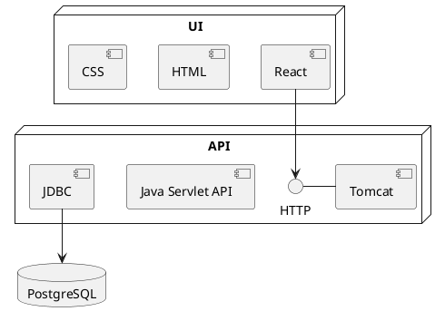

# React Example Project Primer

This primer demonstrates how to build a 2 tier web application utilising Java Servlet, React and PostgreSQL technologies.

## Using this primer

This primer has been designed to take you from *zero* to a *fully functioning system*; this includes installing the required tools and numerous code snippets to build the system piece by piece. If you're not familiar with the various tools used in this primer, you may like to follow it from start to finish. However, if you are familiar with many of the tools you may like to simply reverse engineer (with reference to this primer) the final code base, check it out [here](https://github.com/cis-projects/swen90007-project-templates/tree/main/react-example).

## Requirements

The system we are about to build is simple (very much on purpose), it merely records user votes 'for' and 'against' a topic.

The following users exist:

- anonymous voter users
- privileged admin user

Voter users are unprivileged users that can submit votes and view a live verdict. Voter users are anonymous to the system - that is the system does not authenticate their requests, hence these users are not required to login prior to making requests.

Admin users are privileged users that can manage votes recorded by the system. These users are authenticated by the system, and so must first login before performing privileged actions.

The following requirements exist:

- Voters can submit a vote to the system by providing their voting preference, and optionally a name, and valid email.
- Voters can view the current verdict which shows the tally of votes 'for' and 'against' the campaign
- Admin users manage votes, they can view all submitted votes, including the associated name and email, and can either accept or reject them.
- Rejected votes are removed from the verdict.

## Implementation

### Stack

The following outlines the key technologies that comprise the stack. The stack is split into three communicating systems:

- User Interface (UI) - deployed as a Single Page Application (SPA) built with React
- Application Programming Interface (API) - deployed to the Tomcat webserver and built with JavaEE Servlets
- Database - with PostgreSQL, an enterprise-grade, open source, Relational Database Management System (RDBMS)

### Primer structure

Implementing this stack will be a complicated undertaking. In an effort to manage that complexity, this primer is structured as a number of milestones, which will take you from an empty project directory to a fully fledged system. A brief overview of each milestone is provided below.

#### Milestone -1: Tools

- installation of required tools, Node.js, React, Java, PostgreSQL and pgAdmin.

#### Milestone 0: Hello world

- initial setup, including initializing a React project, JavaEE Webapp project, and local PostgreSQL database.
- an introduction to JSX, React Hooks, and Java Servlets.
- just enough functionality to verify integration between various key components.
- integration concerns, such as CORS
- Spring Security (Part 1)

#### Milestone 1: Deployment

- Docker
- deployment to Render

#### Milestone 2: Core functionality

- core voting functionality, such as submitting a vote, and viewing the verdict.
- beyond React basics, more Hooks, Contexts, and routing
- working with JSON
- database connection pooling

#### Milestone 3: Authentication

- privileged, authenticated admin functionality
- Spring Security (Part 2)
- JavaScript Web Tokens (JWT)
- browser cookies
- session storage

#### Milestone 4: Additional things, just for fun

- some new requirements
- full-duplex communication with Websockets
- some additional integrations

:::{admonition} Skipping milestones
:class: caution
Each milestone builds upon the implementation contributed by previous milestones. You should plan to complete each milestone in order; however, you may wish to skip early milestones if you're confident in your React, JavaEE or integration abilities. If you do skip early milestones, checkout the source code contributed by the previous milestone - for example, if you plan to start from *Milestone 1: Deployment* checkout the code from *Milestone 0: Hello world*. Note that *Milestone -1: Tools* will take you through installing critical dependencies such as a compatible Java JDK and Node.js runtime, be sure to confirm your local development environment is properly set up before proceeding with any of the other milestones.
:::
