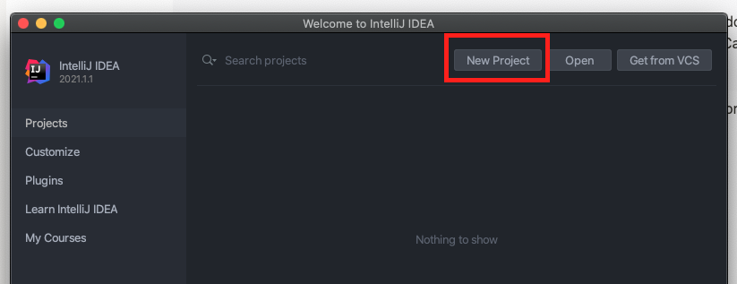
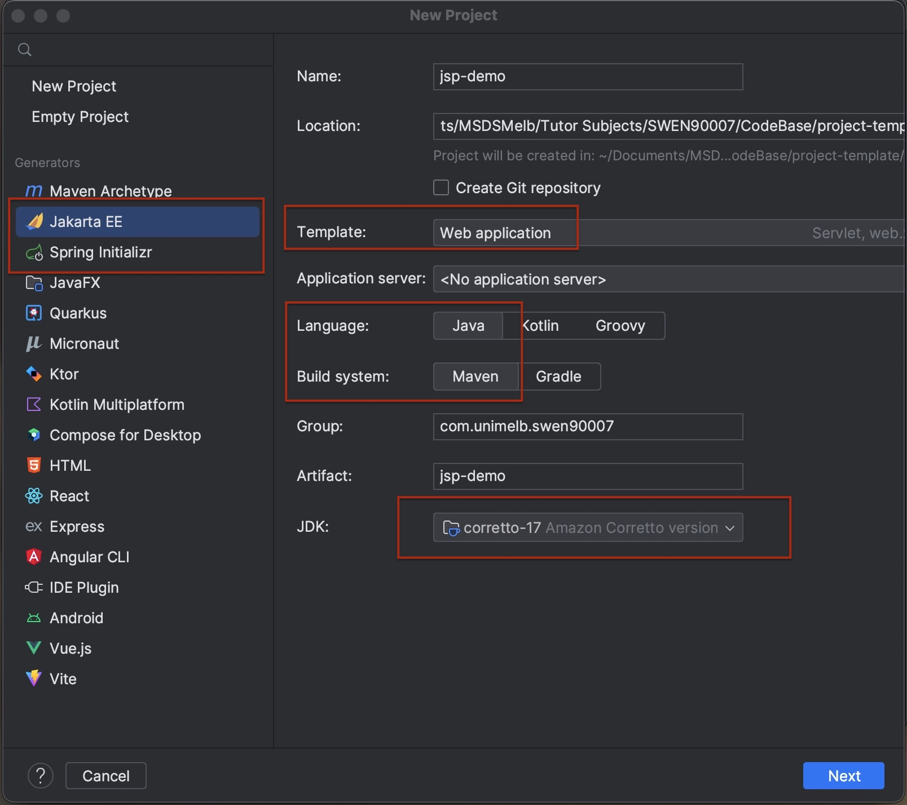
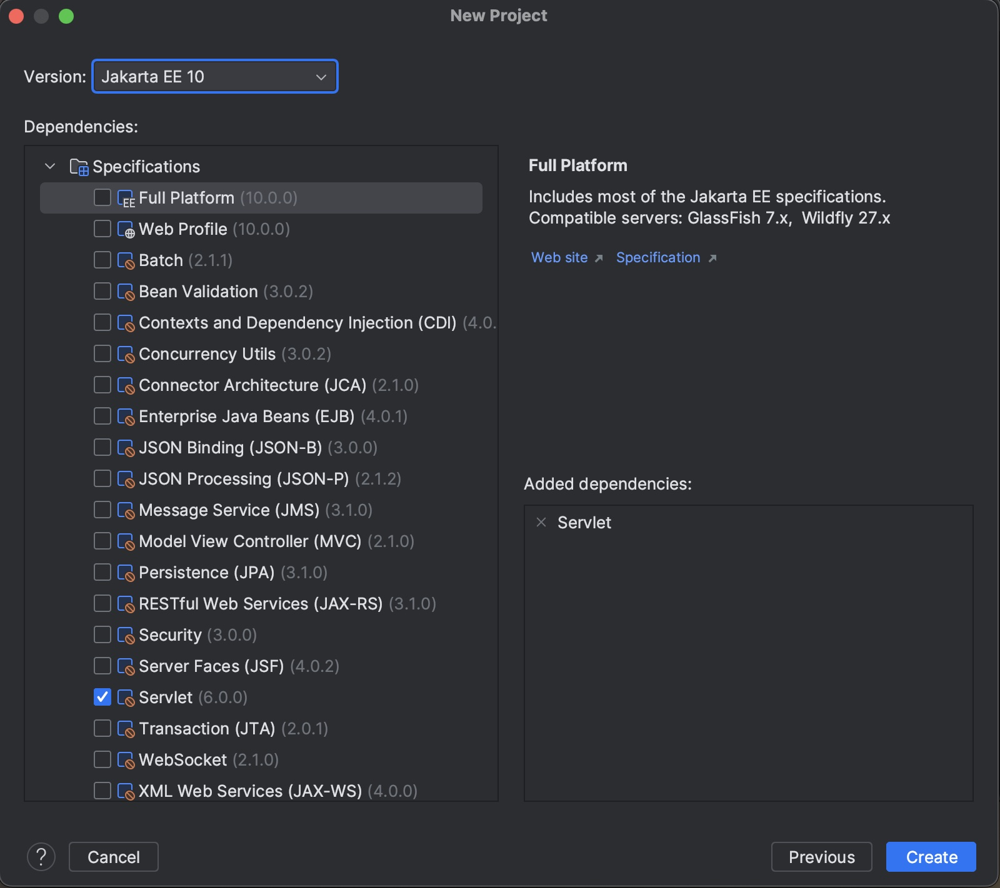
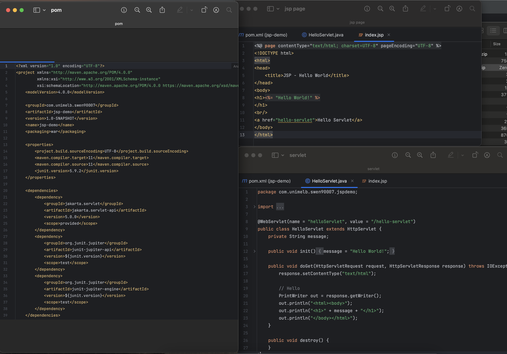
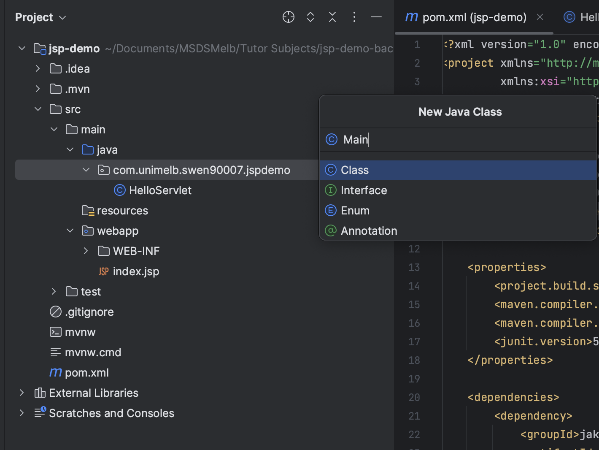
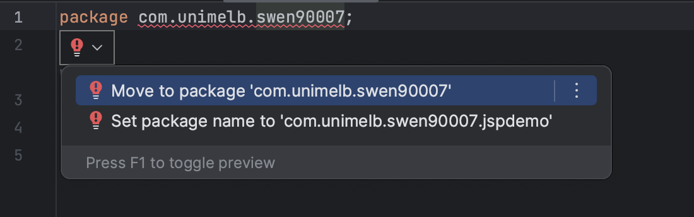
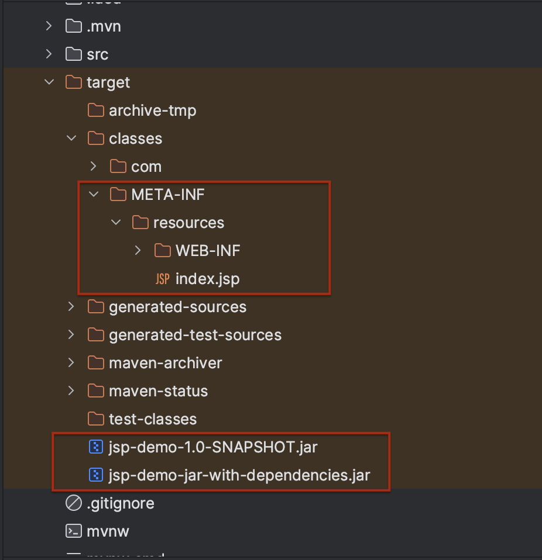
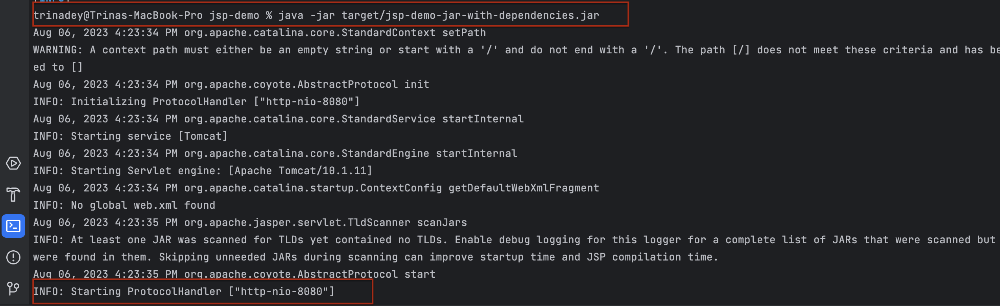
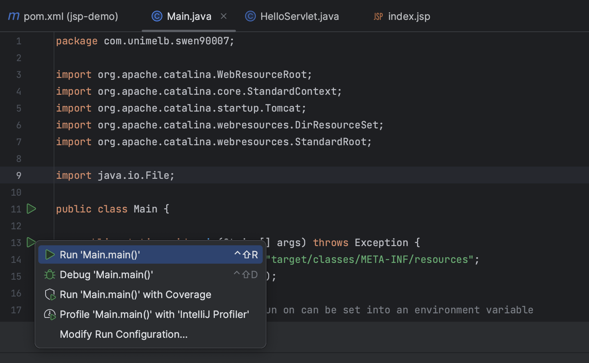

# Step 3: Create Project in IntelliJ

```{attention}
First confirm you have a Java Virtual Machine (JVM) installed on your machine. For Macs, the JVM can normally be found 
in the following directory: {Macintosh HD}/Library/Java/JavaVirtualMachines. If there is no JVM installed on your 
machine, please download one first before attempting these steps.
```

## Create New Java Project

Launch IntelliJ and select New Project:



Select Java Enterprise and enter the information as shown below.

```{important}
Make sure you create the project in a directory you will remember. You will need to push it to GitHub.
```



```{important}
IntelliJ comes bundled with Jakarta Enterprise Edition. If it's not in this list, it means the installation was likely 
corrupted. Try uninstalling and re-installing IntelliJ.
```

Make sure Servlet is selected then select Finish:



IntelliJ will create a HelloWorld Servlet project by default. You can see three files has been created - a jsp file, 
a Servelet and a pom.xml. Maven uses pom.xml to manage dependencies. 



```{important}
Once IntelliJ has finished creating the project (this could take a minute or more), you need to set up Embedded Tomcat 
Code to run the server and see JSP in the browser.
```

To do this, open the pom.xml file and add following dependencies to dependencies block. These dependencies help to run
the project as a standalone java project (run as a jar) with embedded tomcat container. There is no need to setup an external Tomcat Server.
```xml
<dependency>
    <groupId>org.apache.tomcat.embed</groupId>
    <artifactId>tomcat-embed-core</artifactId>
    <version>${tomcat.version}</version>
</dependency>
<dependency>
    <groupId>org.apache.tomcat.embed</groupId>
    <artifactId>tomcat-embed-jasper</artifactId>
    <version>${tomcat.version}</version>
</dependency>
<dependency>
    <groupId>org.apache.tomcat</groupId>
    <artifactId>tomcat-jasper</artifactId>
    <version>${tomcat.version}</version>
</dependency>
<dependency>
    <groupId>org.apache.tomcat</groupId>
    <artifactId>tomcat-jasper-el</artifactId>
    <version>${tomcat.version}</version>
</dependency>
<dependency>
    <groupId>org.apache.tomcat</groupId>
    <artifactId>tomcat-jsp-api</artifactId>
    <version>${tomcat.version}</version>
</dependency>
```
 
Under the properties section add the below property
```xml
<tomcat.version>10.1.11</tomcat.version>
```

Change the packaging of your application from WAR to JAR
```xml
<packaging>jar</packaging>
```

Since we are trying to run an embedded tomcat container as a jar, we would like to package everything in one single jar
(also known as fat jar or uber jar). To do this, replace the build tag under pom.xml with below
```xml
<build>
    <resources>
        <resource>
            <directory>src/main/webapp</directory>
            <targetPath>META-INF/resources</targetPath>
        </resource>
    </resources>
    <plugins>
        <plugin>
            <groupId>org.apache.maven.plugins</groupId>
            <artifactId>maven-assembly-plugin</artifactId>
            <configuration>
                <descriptorRefs>
                    <descriptorRef>jar-with-dependencies</descriptorRef>
                </descriptorRefs>
                <finalName>jsp-demo</finalName>
                <archive>
                    <manifest>
                        <mainClass>com.unimelb.swen90007.Main</mainClass>
                    </manifest>
                </archive>
            </configuration>
            <executions>
                <execution>
                    <phase>package</phase>
                    <goals>
                        <goal>single</goal>
                    </goals>
                </execution>
            </executions>
        </plugin>
    </plugins>
</build>
```
The descriptorRef jar-with-dependencies helps to create a fat-jar with all the dependencies in-built.
It is important that you mention the correct path to main Class. This is a fully descriptive classname along with it's 
package. If you rename your package to something else, please do not forget to update the tag under `manifest`

```xml
<mainClass>com.unimelb.swen90007.Main</mainClass>
```

```{important}
It is important that you place your jsp files in src/main/webapp and while packaging a jar, it is placed under
META-INF/resources. This helps the embedded tomcat to look for your jsp files at the right place and render those pages.
```

## Run with Embedded Tomcat

Under the project tab, create a new file named Main under the package `com.unimelb.swen90007`.

```{important}
If you face problem creating it under the package swen90007, create it under package jspdemo and then change the package
name in the file (remove jspdemo) and move the file to the right package
```


In the file add below code

```java
package com.unimelb.swen90007;

import org.apache.catalina.WebResourceRoot;
import org.apache.catalina.core.StandardContext;
import org.apache.catalina.startup.Tomcat;
import org.apache.catalina.webresources.DirResourceSet;
import org.apache.catalina.webresources.StandardRoot;

import java.io.File;

public class Main {

    public static void main(String[] args) throws Exception {
        String webappDirLocation = "target/classes/META-INF/resources";
        Tomcat tomcat = new Tomcat();

        //The port that we should run on can be set into an environment variable
        //Look for that variable and default to 8080 if it isn't there.
        String webPort = System.getenv("PORT");
        if(webPort == null || webPort.isEmpty()) {
            webPort = "8080";
        }

        tomcat.setPort(Integer.parseInt(webPort));
        
        StandardContext ctx = (StandardContext) tomcat.addWebapp("/", new File(webappDirLocation).getAbsolutePath());
        // Declare an alternative location for your "WEB-INF/classes" dir
        // Servlet 3.0 annotation will work
        File additionWebInfClasses = new File(".");
        WebResourceRoot resources = new StandardRoot(ctx);
        resources.getContext().setAddWebinfClassesResources(true);
        resources.addPreResources(new DirResourceSet(resources, "/WEB-INF/classes",
                additionWebInfClasses.getAbsolutePath(), "/"));
        ctx.setResources(resources);
        
        tomcat.getConnector();
        tomcat.start();
        tomcat.getServer().await();


    }
}
```

In the terminal run `mvn clean package`. This will compile the code and package it into a jar. Upon successful build, you
can see that a target folder is created and there are two jars present.



In the terminal run below command (assuming that you are in the code directory jsp-demo). Note that we are running the jar
with the dependencies.
```
java -jar target/jsp-demo-jar-with-dependencies.jar 
```


Alternatively, you can run the main method within the Intellij to avoid running `mvn clean package` or `java -jar` commands.



Once you can see that your server is running on port 8080 you can view this in the browser. The project should be 
deployed to localhost:


```{admonition} What's Next
Please proceed to [Step 4: Setup GitHub Repository](5_github_setup.md).
```
