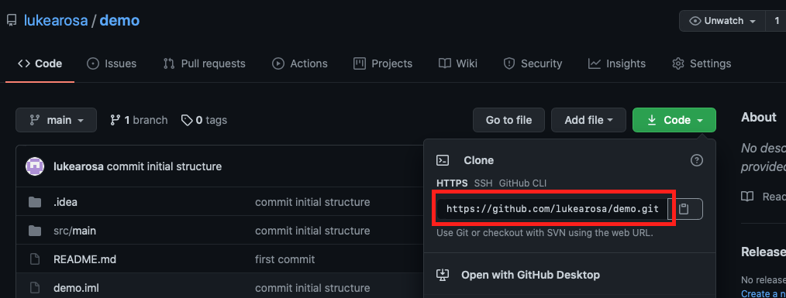

# Step 4: Setup GitHub Repository

```{important}
You should have been invited to the GitHub set up for this project. Make sure you create a repository inside the team on Classrooms.

*Make sure you set the repository as private* to avoid others plagiarising your work. You **will** be help responsible 
under the university's academic integrity policy if someone plagiarises off your work (even if you were unaware they were
plagiarising).  
```

Once you have created a repository, open a terminal window. Navigate into the project you created in step 3.

Get the web URL of the repository you have created:


Change "demo" to be whatever you named your repository:
````
echo "# demo" >> README.md
git init
git add README.md
git commit -m "first commit"
git branch -M main
````

Change the URL to be the URL of your repository:
````
git remote add origin https://github.com/lukearosa/demo.git
git push -u origin main
git add .
git commit -m "create initial structure"
git push
````

Once done, your repository will have the project you have just created in IntelliJ.

```{admonition} What's Next
Please proceed to [Step 5: Clone GitHub Repository](6_github_clone.md).
```
