# Step 9: Deploy to Render

Render is a cloud provider where students can deploy their applications for free. You can deploy different kind of applications:

- Node
- React
- Postgres
- Docker Image

Based on your choice of implementation you can refer to different part of this guide. Create your account on [Render](https://render.com/)

## Deploying Postgres

Once you have logged in, Go to Dashboard page and click on New tab to create a Postgres database on Render.

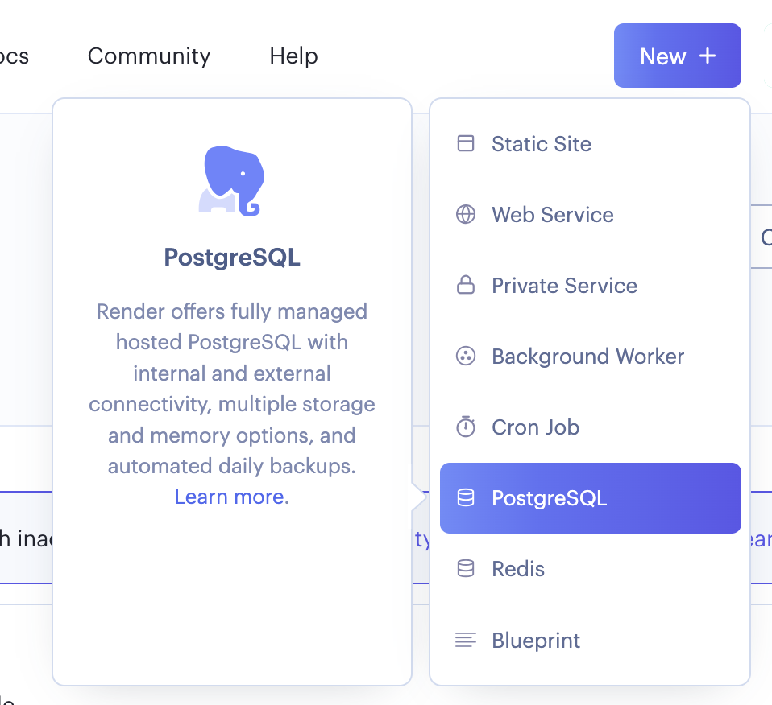

Add database name, user, password etc. You can choose the free tier that has upto 1 Gb of space available.

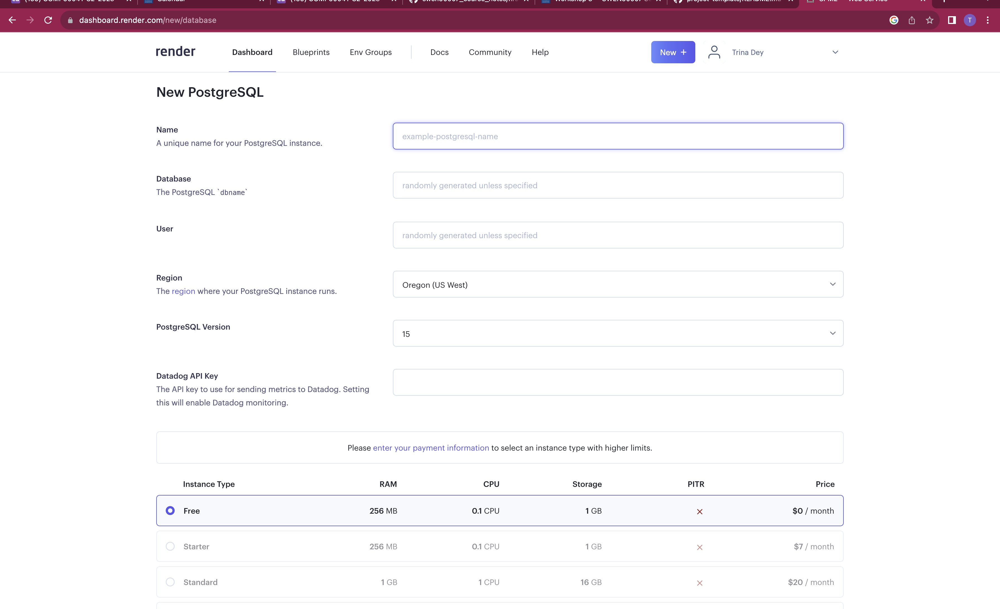

```{attention}
There are restrictions for database name and username. Please create unique names as per the guidelines.
```


```{attention}
Lastly, the database is not backed up. It is important that you export some of the data from Postgres and keep it stored
in your github repository, so that if you lose some data, you can repopulate the database from these data dump. 
```

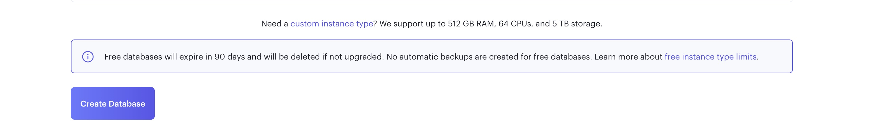

Once the database is generated, you can see these fields are populated and you can use the connection string, user, 
password etc in your java code. Note that there is an external and internal address created. You can only use internal 
database url from code deployed on Render. If you are running your code locally and trying to connect to postgres DB on 
Render, you need to use the External Database Url.

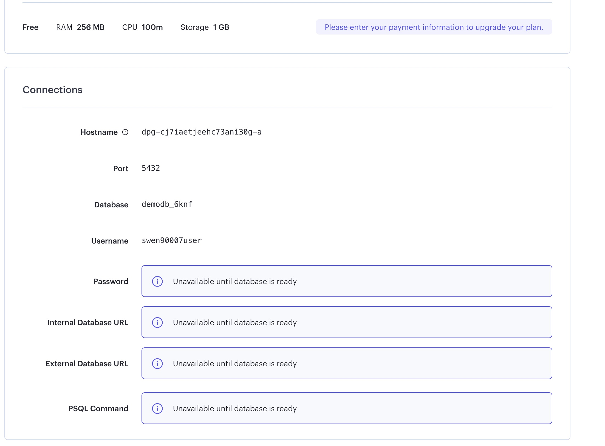

## Deploying Java App

To deploy for a docker registry, you need to enable the settings. Go to settings page and enable deployment from external registries

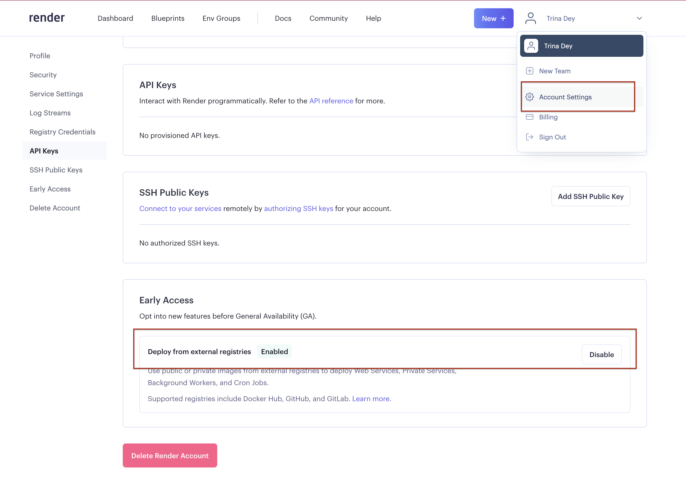

Once you have enabled the settings to deploy from docker registry, you can click on New to create a web service.

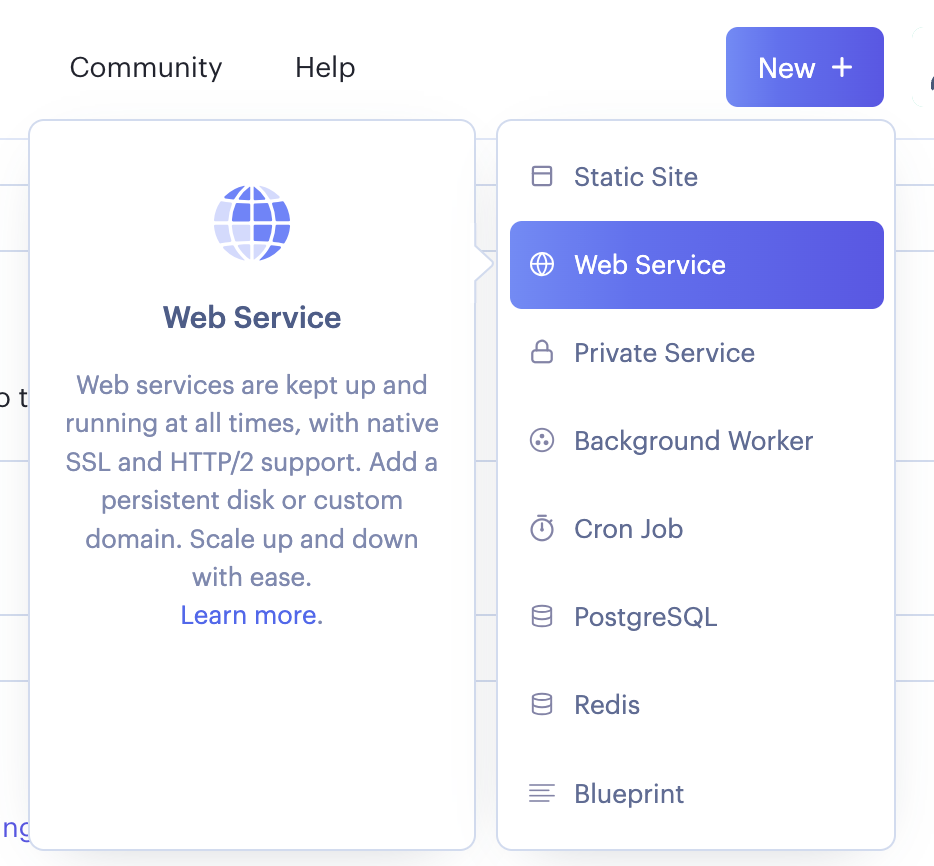

This will show you two options, deploy from Git Repository, or deploy from existing image repository. Since java is not 
supported by Render, we will deploy from an image repository viz. DockerHub.

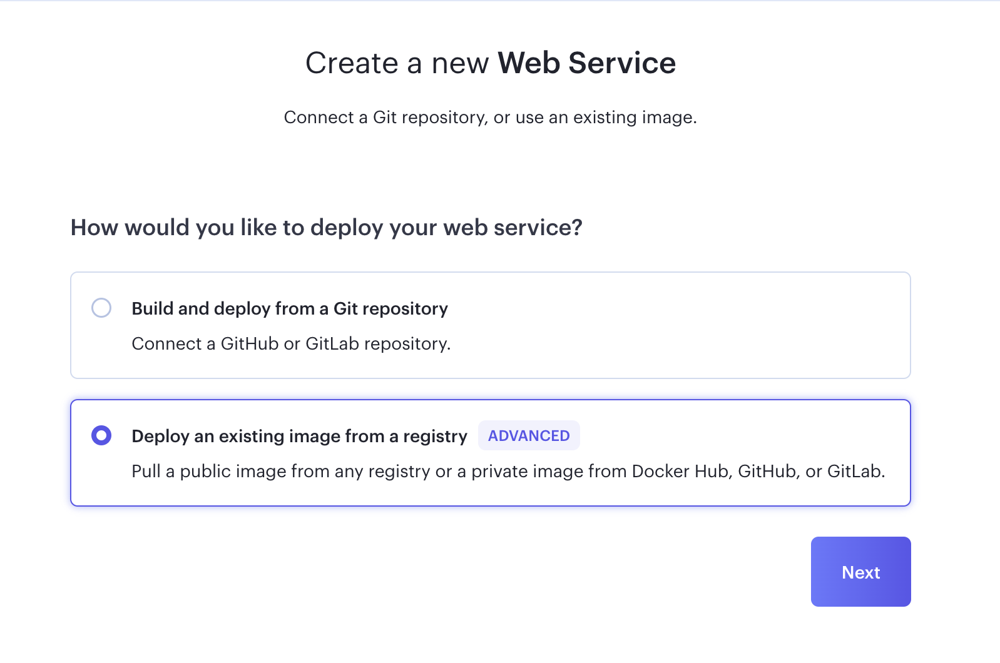

Your image url can be found on your Dockerhub. It is equivalent to docker.io/<username>/<repo name>:<tag name>. In this case
it shows docker.io/trinad45/swen90007:jsp-demo. This is the same tag we have used while pushing to the Docker hub.

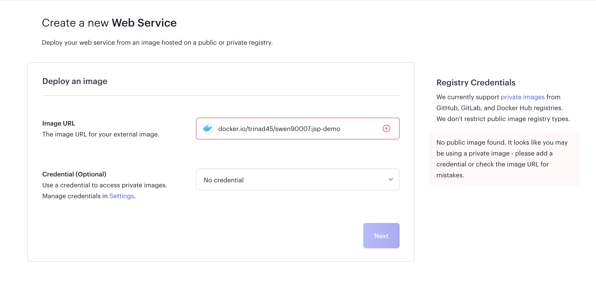

Note that since our repo is private, it cannot be connected unless you provide your Docker Hub credentials to it.

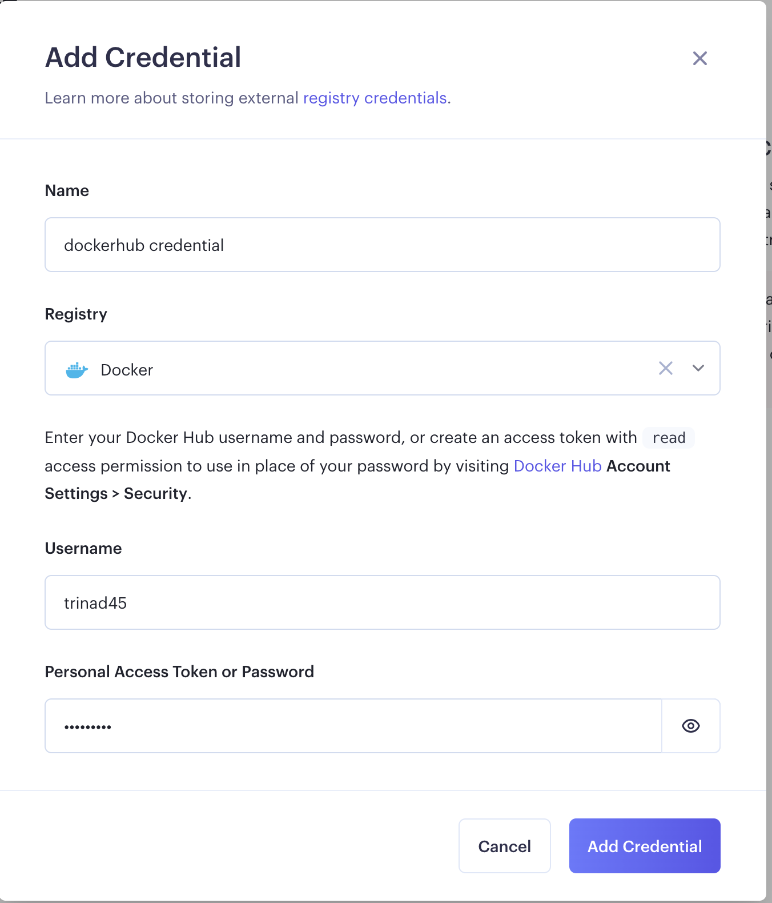

Once the credentials are added, Render can verify the image and will show a green tick against your image url.

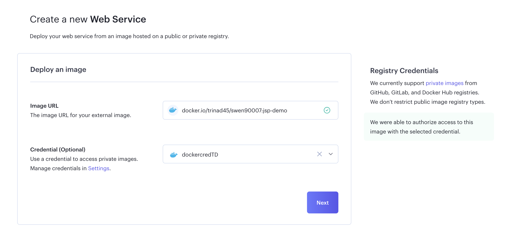

Click on next and provide a meaningful name to your web application. Choose the free tier. With this if your server is
not accessed it will scale down to 0, but it will redeploy if someone tries to access it.

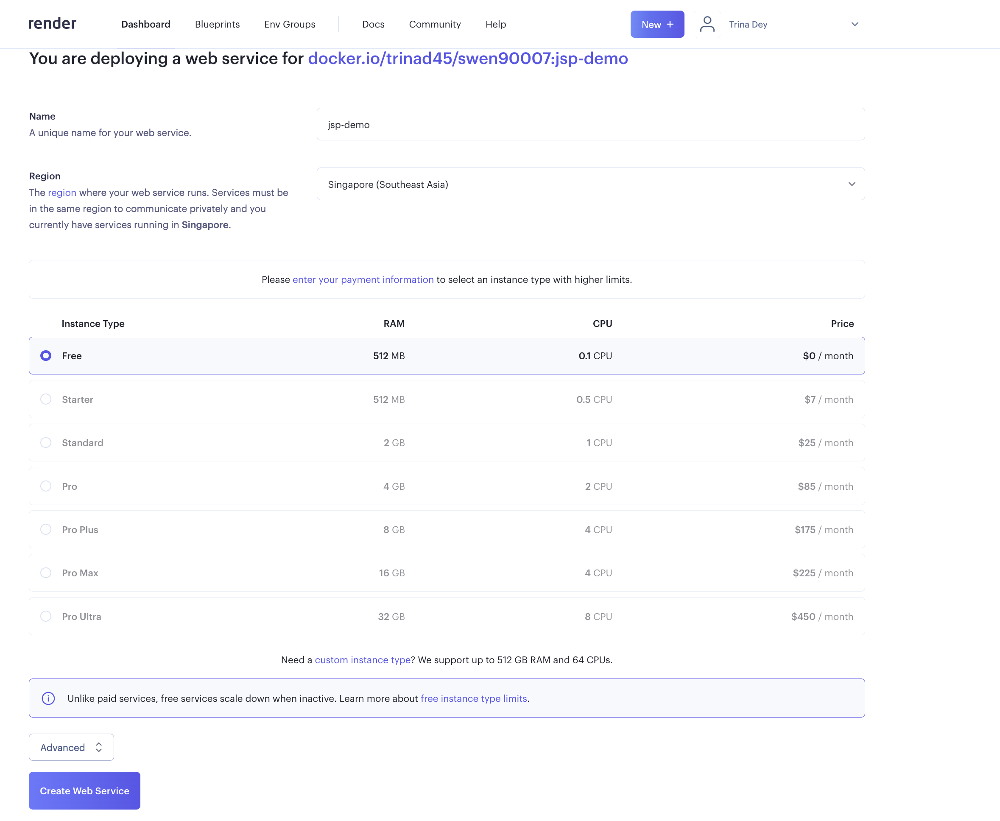

Once you go ahead and create the webservice, it will try to deploy the docker file and start the embedded tomcat server.
You can see logs similar to deployment on your local. On the top, you can also see the url for the deployed web application.

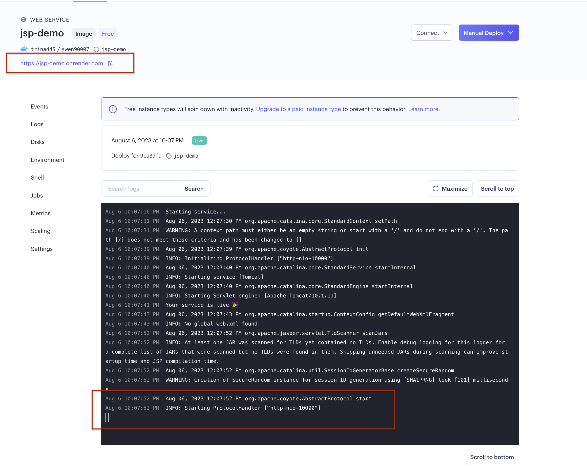

Open the url in the browser and you can see your application is deployed successfully. Don't forget to add the war name
(like 'jsp-demo' in our case) in the url.

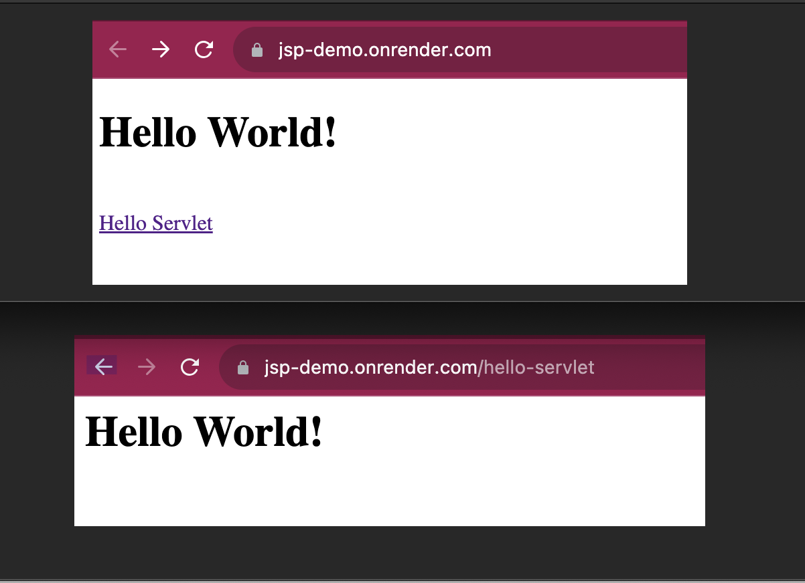
