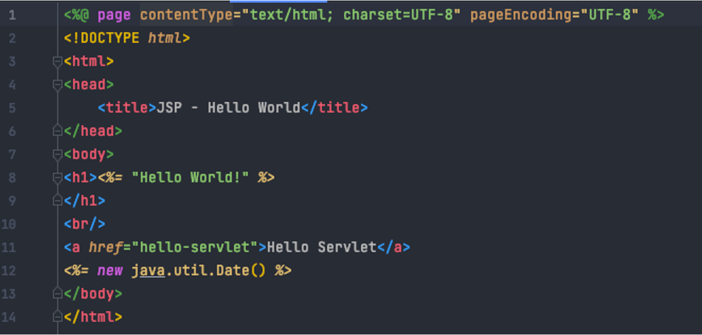
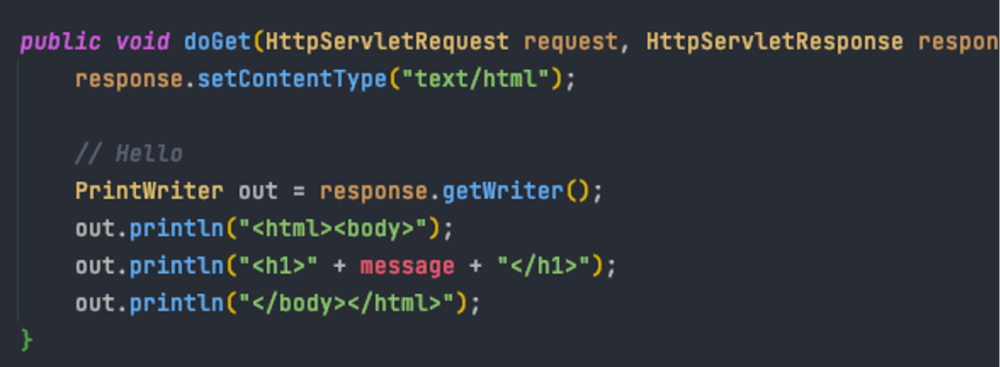

# Workshop 3

```{admonition} By Now You Should Have
:class: important
- Completed part 1
- Completed set up of development environment to progress part 2
```

```{admonition} Today's Workshop
Purpose of today's workshop is to begin working on part 2 of the project and discuss Java web development.
```

## Part 1 results
Part 1 will be marked within 2 weeks of submission. We will discuss common mistakes in next week's workshop.

## Java Web Development

You will build your application on Java Servlets and Java Server Pages (JSPs) - a low-level API that that is the 
building blocks for modern day Java web frameworks.  

```{tip}
Modern Java frameworks (like Spring, Struts, Hibernate, etc) abstract the role of servlets.
```

In this subject, you will learn the building blocks, which will allow you to develop an appreciation for the role of 
frameworks. Learning frameworks would tie your knowledge to that framework, and would not teach you enough about Java 
fundamentals.
If you wish to learn one of these frameworks, there are many free resources online.

### Servlets


A servlet is used to implement web applications and is simply a class which responds to an HTTP request.

Servlets provide a low-level API for receiving and responding to HTTP requests.

Servlets are the Java programs that runs on the Java-enabled web server or application server. They are used to 
handle the request obtained from the web server, process the request, produce the response, then send response 
back to the web server.

### JSPs

Java Server Pages (JSP) is a server-side programming technology that enables the creation of a dynamic, platform 
independent method for building Web-based applications



```{important}
*JSP introduces Java into HTML.*

**JSPs vs. HTML**  
HTML cannot contain dynamic information.

**JSPs vs. JavaScript**  
Server-side vs. client-side (JavaScript is not based on Java!).

**JSPs vs. pure servlets**  
JSPs are used in conjunction with servlets.
```

You don't need to use JSPs with servlet... but you should:



```{tip}
This is an example of writing HTML in a servlet - it is tedious and does not separate roles of back-end and 
front-end developers.*
```

### JSPs + Servlets + Domain Model = MVC Pattern


```{admonition} Definition
JSPs (or view) layer represents the output of the application, usually some form of UI. The presentation layer is used 
to display the Model data fetched by the Controller.
```

```{admonition} Definition
Controller layer acts as an interface between View and Model. It receives requests from the View layer and processes 
them, including the necessary validations.
```

```{admonition} Definition
Domain model is the layer which contains business logic of the system, and also represents the state of the 
application.
```

#### MVC Pattern In Your Assignment


### Apache TomCat

```{note}
TomCar acts as both a web server and container.
```

Web servers are great at serving static pages (but cannot create dynamic pages). This is the role servlets play - they 
can dynamically create pages to send as a response to the client. Dynamic web pages didn’t exist before the request.

Servlets don't have main methods the server can call, so instead when the web server gets a request for a servlet, the 
server hands the request to the container in which the servlet is deployed. The container gives the HTTP request to the 
servlet and calls the servlet's doGet() and doPost() methods.


#### Benefits of Using TomCat as a Container

Apache TomCat, as a container, handles several issues for you:

1. Communications support: The container creates an easy way for your server to talk to your servlets. The container 
knows the protocol to use to speak to the server, so you don't have to make use of an API in your servlets in order to 
speak to the server.
2. Lifecycle management: The container controls the life and death of your servlets. It loads classes, instantiates 
servlets, knows which servlet method to call, and handles garbage collection, so you don't have to worry as much about 
managing resources.
3. JSP support: The container translates JSP code into Java.

```{admonition} Extra Resources
:class: tip
1. Head First Servlets & JSP by Bryan Basham; and
2. Check course notes for resources to practice creating your first web project using servlets and JSPs.
```

## Time for a Demo

```{attention}
You can download the demo file from the repository.
```
